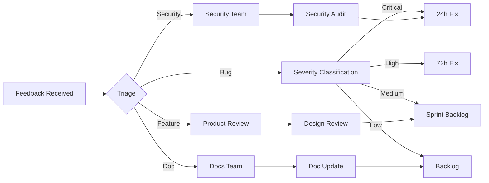

# Early Access Program v2.0 — ed2kIA

> **Program Version:** 2.0
> **Date:** 2026-05-16
> **Status:** Active — FASE 87
> **Duration:** 8 weeks (2026-05-16 → 2026-07-04)
> **Cohort Size:** 50 participants (target)

---

## 1. Program Overview

### 1.1 Purpose

The ed2kIA Early Access Program v2.0 provides structured access to v2.0 pre-release features for community contributors, researchers, and enterprise partners. Participants gain early access to Neural Steer, Tauri GUI, K8s deployments, WASM hardening and ZKP optimizations in exchange for structured feedback.

### 1.2 Objectives

| Objective | Metric | Target |
|-----------|--------|--------|
| Feature Validation | Bug reports per module | ≥5 per module |
| Usability Testing | UX feedback forms | ≥30 completed |
| Performance Baseline | Benchmark submissions | ≥20 runs |
| Security Review | Security findings | ≥3 external findings |
| Documentation Quality | Doc improvement PRs | ≥10 merged |

### 1.3 Eligibility

| Tier | Requirements | Access Level |
|------|-------------|--------------|
| **Core** | Active contributor (≥5 PRs merged) | Full access, all features |
| **Researcher** | Academic/industry research affiliation | Neural Steer, ZKP, benchmarks |
| **Enterprise** | Organization with deployment plans | K8s, WASM, full stack |
| **Community** | Active community member (≥3 months) | GUI, basic features |

---

## 2. Feature Access Matrix

### 2.1 v2.0-sprint2 Features

| Feature | Module | Core | Researcher | Enterprise | Community |
|---------|--------|------|-----------|-----------|-----------|
| Neural Steer UI | `neural_steer_ui` | ✅ | ✅ | ✅ | ✅ |
| Neural Tauri Bridge | `neural_tauri_bridge` | ✅ | ✅ | ✅ | ⚠️ Read-only |
| Tauri GUI Scaffold | `tauri_scaffold` | ✅ | ✅ | ✅ | ✅ |
| Commitment Pool | `commitment_pool` | ✅ | ✅ | ✅ | ❌ |
| WASM Mobile Hardening | `mobile_hardening` | ✅ | ✅ | ✅ | ❌ |
| K8s Manifests | `k8s_manifests/` | ✅ | ❌ | ✅ | ❌ |
| Multi-Curve ZKP | `multi_curve_setup` | ✅ | ✅ | ✅ | ❌ |

### 2.2 Feature Flags

```bash
# Full v2.0-sprint2 access
cargo run --features v2.0-sprint2

# Neural Steer only
cargo run --features v2.0-sprint2 -- --module neural_steer

# ZKP optimization only
cargo run --features v2.0-sprint2 -- --module zkp

# K8s deployment (Enterprise only)
kubectl apply -f src/infra/k8s_manifests/
```

---

## 3. Feedback Pipeline

### 3.1 Feedback Channels

| Channel | Purpose | Response Time | Tool |
|---------|---------|--------------|------|
| **GitHub Issues** | Bug reports, feature requests | 48h | GitHub Issues |
| **Discussions** | Design feedback, Q&A | 72h | GitHub Discussions |
| **Feedback Form** | Structured UX feedback | Weekly digest | Google Forms / Typeform |
| **Security Reports** | Vulnerability disclosure | 24h | GitHub Security Advisories |
| **Benchmark Submissions** | Performance data | Automated | CI/CD pipeline |

### 3.2 Feedback Templates

#### Bug Report Template

```markdown
---
name: v2.0 Early Access Bug Report
about: Report a bug in v2.0 pre-release features
title: "[EA-v2.0] "
labels: early-access, v2.0
assignees: ''
---

**Module:** (neural_steer | tauri_gui | zkp | wasm | k8s)
**Feature Flag:** v2.0-sprint2
**Environment:**
- OS:
- Rust version:
- Cargo features:

**Reproduction Steps:**
1.
2.
3.

**Expected Behavior:**

**Actual Behavior:**

**Logs/Output:**

**Severity:** (Critical | High | Medium | Low)
```

#### Feature Feedback Template

```markdown
---
name: v2.0 Feature Feedback
about: Provide feedback on v2.0 pre-release features
title: "[EA-v2.0] Feedback: "
labels: early-access, feedback
---

**Module:**

**What works well:**

**What could be improved:**

**Missing functionality:**

**Suggestions:**

**Use case context:**
```

### 3.3 Feedback Processing Workflow



---

## 4. Onboarding Process

### 4.1 Participant Onboarding

| Step | Action | Timeline |
|------|--------|----------|
| 1 | Application review | Day 0-2 |
| 2 | NDA + Code of Conduct sign-off | Day 2-3 |
| 3 | Access provisioning | Day 3-4 |
| 4 | Welcome session | Day 5-7 |
| 5 | First feature exploration | Week 2 |
| 6 | First feedback submission | Week 3 |

### 4.2 Welcome Package

Each participant receives:

1. **Access Credentials:** Feature flag activation, private repo access (if applicable)
2. **Documentation:** This guide, API docs, architecture overview
3. **Quick Start Guide:** Module-specific setup instructions
4. **Feedback Templates:** Pre-formatted templates for each channel
5. **Contact Info:** Dedicated support channel, point of contact

### 4.3 Quick Start by Module

#### Neural Steer

```bash
# Build with Neural Steer
cargo build --features v2.0-sprint2

# Run with UI
cargo run --features v2.0-sprint2 -- --gui

# Test ethical bounds
cargo test --features v2.0-sprint2 neural_tauri_bridge
```

#### ZKP Optimization

```bash
# Run benchmarks
cargo bench --features v2.0-sprint2 commitment_pool

# Verify proofs
cargo test --features v2.0-sprint2 commitment_pool
```

#### K8s Deployment (Enterprise)

```bash
# Apply manifests
kubectl apply -f src/infra/k8s_manifests/node_deployment.yaml
kubectl apply -f src/infra/k8s_manifests/steering_service.yaml
kubectl apply -f src/infra/k8s_manifests/lease_configmap.yaml

# Verify deployment
kubectl get pods -l app=ed2k-node
kubectl get svc -l app=ed2k-steering
```

---

## 5. Milestones & Timeline

### Week 1-2: Onboarding

- [ ] Participant applications reviewed
- [ ] Access provisioning complete
- [ ] Welcome sessions conducted
- [ ] Initial feature exploration

### Week 3-4: Neural Steer & GUI Focus

- [ ] Neural Steer usability testing
- [ ] Tauri GUI feedback collection
- [ ] Ethical bounds validation
- [ ] First feedback round due

### Week 5-6: ZKP & WASM Focus

- [ ] Commitment Pool benchmarking
- [ ] WASM hardening validation
- [ ] Performance data collection
- [ ] Second feedback round due

### Week 7-8: K8s & Integration

- [ ] K8s deployment testing (Enterprise)
- [ ] End-to-end integration validation
- [ ] Final feedback round due
- [ ] Program retrospective

---

## 6. Incentives & Recognition

### 6.1 Participant Benefits

| Benefit | Description |
|---------|-------------|
| **Early Access** | 8 weeks before public release |
| **Direct Influence** | Feedback shapes final product |
| **Recognition** | Contributor badge, release notes credit |
| **Support** | Dedicated support channel |
| **Networking** | Access to core team and other participants |
| **Swag** | ed2kIA merchandise for active contributors |

### 6.2 Recognition Tiers

| Tier | Criteria | Reward |
|------|----------|--------|
| **Champion** | ≥10 quality feedback submissions | Core team call, swag pack, release notes feature |
| **Contributor** | ≥5 quality feedback submissions | Contributor badge, release notes credit |
| **Participant** | ≥1 feedback submission | Thank you in community post |

---

## 7. Metrics & Success Criteria

### 7.1 Program Metrics

| Metric | Target | Measurement |
|--------|--------|-------------|
| Participant Retention | ≥80% | Weekly check-ins |
| Feedback Volume | ≥100 submissions | GitHub Issues + Forms |
| Bug Discovery Rate | ≥20 bugs | Tracked issues |
| Feature Adoption | ≥70% use ≥2 modules | Usage analytics |
| NPS Score | ≥50 | End-of-program survey |

### 7.2 Success Criteria

| Criterion | Threshold | Status |
|-----------|-----------|--------|
| Minimum participants | 30 | Tracking |
| Minimum feedback per module | 5 | Tracking |
| Critical bugs found pre-release | All resolved | Tracking |
| Documentation improvements | ≥10 PRs | Tracking |
| Participant satisfaction | ≥4/5 | End survey |

---

## 8. Risk Management

### 8.1 Program Risks

| Risk | Likelihood | Impact | Mitigation |
|------|-----------|--------|-----------|
| Low participation | Medium | High | Aggressive outreach, incentives |
| Feedback quality | Medium | Medium | Templates, training, review |
| Feature instability | High | Medium | Clear pre-release labeling, rollback |
| Security exposure | Low | Critical | NDA, limited access, monitoring |
| Scope creep | Medium | Medium | Strict feature freeze, backlog |

### 8.2 Exit Criteria

Program concludes when:
1. 8-week timeline complete
2. All critical bugs resolved
3. Final feedback round collected
4. Retrospective completed
5. v2.0.0-stable release ready

---

## 9. Application Process

### 9.1 How to Apply

1. **Submit Application:** [GitHub Issue Template](https://github.com/Stuartemk/ed2kIA/issues/new)
2. **Select Tier:** Core, Researcher, Enterprise, or Community
3. **Provide Context:** Use case, expertise, availability
4. **Sign Agreements:** NDA + Code of Conduct
5. **Await Approval:** 48-72 hour review

### 9.2 Application Template

```markdown
---
name: Early Access v2.0 Application
about: Apply for ed2kIA v2.0 Early Access Program
title: "[EA-Apply] "
labels: early-access, application
---

**Name/Organization:**
**Tier Requested:** (Core | Researcher | Enterprise | Community)
**Use Case:**
**Relevant Experience:**
**Availability:** (hours/week)
**Modules of Interest:**
```

---

## 10. Contact & Support

| Channel | Purpose | Response Time |
|---------|---------|--------------|
| **GitHub Issues** | Bugs, features | 48h |
| **Discussions** | Q&A, feedback | 72h |
| **Email** | Applications, NDA | 24h |
| **Security** | Vulnerabilities | 24h |

**Program Lead:** ed2kIA Core Team
**Support Email:** early-access@ed2kia.org (placeholder)

---

*Program launched: 2026-05-16 (FASE 87)*
*Program end: 2026-07-04*
*Next review: Weekly*
