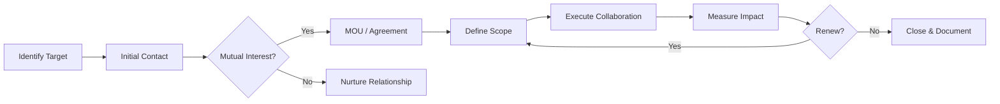

# Long-term Sustainability Framework v2.0 — ed2kIA

> **Document Version:** 2.0
> **Date:** 2026-05-16
> **Status:** Active — FASE 88
> **Review Cycle:** Quarterly

---

## 1. Sustainability Vision

### 1.1 Mission

Ensure ed2kIA remains a viable, secure, and evolving open-source project for the next 5+ years through diversified funding, active community governance, technical excellence and strategic partnerships.

### 1.2 Core Principles

| Principle | Description |
|-----------|-------------|
| **Financial Independence** | Diversified revenue streams reducing single-point dependency |
| **Community Ownership** | Decentralized governance with transparent decision-making |
| **Technical Excellence** | Continuous investment in code quality, security and performance |
| **Open Innovation** | Open collaboration with academia, industry and other OSS projects |
| **Ethical AI** | Unwavering commitment to ethical AI behavior and transparency |

---

## 2. Funding Strategy

### 2.1 Revenue Streams

| Stream | Source | Target (Annual) | Status |
|--------|--------|-----------------|--------|
| **Grants** | Ethereum Foundation, Molecule, Optimism | $50K-100K | Active |
| **Sponsorships** | GitHub Sponsors, Open Collective | $24K-60K | Active |
| **Enterprise Support** | Custom deployments, SLAs | $50K-200K | Planning |
| **Consulting** | Architecture reviews, integration | $30K-100K | Planning |
| **Training** | Workshops, certifications | $10K-30K | Future |
| **Merchandise** | Community swag | $5K-15K | Future |

### 2.2 Budget Allocation

| Category | % of Budget | Priority |
|----------|-------------|----------|
| Core Development | 40% | Critical |
| Security Audits | 15% | Critical |
| Community Programs | 15% | High |
| Infrastructure | 10% | High |
| Documentation | 10% | Medium |
| Events & Outreach | 5% | Medium |
| Legal & Compliance | 5% | Medium |

### 2.3 Financial Transparency

- **Quarterly Reports:** Public budget and expenditure reports
- **Open Ledger:** All transactions tracked in public spreadsheet
- **Community Review:** Budget proposals reviewed by governance

---

## 3. Partnership Strategy

### 3.1 Partnership Tiers

| Tier | Commitment | Benefits | Examples |
|------|-----------|----------|----------|
| **Strategic** | Deep integration, co-development | Joint branding, shared roadmap | Ethereum Foundation, libp2p |
| **Technology** | Technical integration | API access, early features | arkworks, wasmtime |
| **Community** | Community programs | Cross-promotion, events | Rust Foundation, OSSU |
| **Academic** | Research collaboration | Publications, data access | Universities, research labs |

### 3.2 Target Partnerships

#### Strategic Partners

| Organization | Value Proposition | Status | Action Item |
|-------------|-------------------|--------|-------------|
| **Ethereum Foundation** | ZKP research, grants | Exploring | Submit grant proposal |
| **Protocol Labs (libp2p)** | P2P networking, infrastructure | Active | Deepen integration |
| **Bytecode Alliance** | WASM security, performance | Active | Security review collaboration |
| **Rust Foundation** | Language support, education | Future | Education program |

#### Technology Partners

| Organization | Integration Point | Status |
|-------------|-------------------|--------|
| **arkworks** | ZKP circuits | Active dependency |
| **wasmtime** | WASM sandbox | Active dependency |
| **candle-core** | ML inference | Active dependency |
| **Hugging Face** | Model hosting | Future integration |

#### Academic Partners

| Institution | Research Area | Status |
|------------|---------------|--------|
| TBD | Federated Learning | Recruiting |
| TBD | ZKP Optimization | Recruiting |
| TBD | Ethical AI Alignment | Recruiting |

### 3.3 Partnership Development Process

---

## 4. Community Sustainability

### 4.1 Contributor Pipeline

| Stage | Goal | Metrics | Programs |
|-------|------|---------|----------|
| **Awareness** | Reach potential contributors | Impressions, visits | Blog, social, talks |
| **Onboarding** | First contribution | First PRs, issues | good-first-issue, mentorship |
| **Engagement** | Regular contributions | Active monthly contributors | Sprint planning, recognition |
| **Leadership** | Project maintainers | New maintainers | Governance, delegation |
| **Alumni** | Sustained network | Alumni engagement | Newsletter, events |

### 4.2 Retention Strategies

| Strategy | Description | Frequency |
|----------|-------------|-----------|
| **Recognition** | Contributor spotlights, badges | Monthly |
| **Mentorship** | Pair new with experienced contributors | Ongoing |
| **Growth** | Skill development opportunities | Quarterly |
| **Autonomy** | Self-directed project ownership | Ongoing |
| **Purpose** | Connect work to mission | Continuous |
| **Compensation** | Stipends, grant funding | As available |

### 4.3 Burnout Prevention

| Measure | Implementation |
|---------|---------------|
| **Sustainable Pace** | No mandatory overtime, realistic deadlines |
| **Rotation** | Rotate high-responsibility roles |
| **Sabbatical** | Paid time off for core contributors |
| **Delegation** | Distribute leadership across team |
| **Health Check** | Regular contributor wellbeing surveys |
| **Succession** | Documented handover processes |

---

## 5. Technical Sustainability

### 5.1 Technical Debt Management

| Practice | Frequency | Owner |
|----------|-----------|-------|
| **Debt Inventory** | Catalog known technical debt | Monthly |
| **Debt Sprints** | Dedicated debt reduction sprints | Quarterly |
| **Code Review** | Mandatory review for all changes | Continuous |
| **Automated Testing** | Maintain ≥90% test coverage | Continuous |
| **Dependency Updates** | Regular dependency audits | Weekly |
| **Architecture Review** | Evaluate architectural decisions | Quarterly |

### 5.2 Knowledge Management

| Asset | Format | Location | Update Frequency |
|-------|--------|----------|-----------------|
| Architecture Docs | Markdown | `docs/` | Per change |
| API Documentation | Rustdoc | Auto-generated | Per release |
| Runbooks | Markdown | `docs/OPERATIONS_RUNBOOK.md` | Per change |
| Decision Records | ADR format | `docs/adr/` | Per decision |
| Onboarding Guide | Markdown | `CONTRIBUTING.md` | Quarterly |
| Video Tutorials | Video | YouTube | As needed |

### 5.3 Release Cadence

| Release Type | Frequency | Cycle | Examples |
|-------------|-----------|-------|----------|
| **Stable** | Quarterly | 12 weeks | v1.6.0, v2.0.0 |
| **Sprint** | Bi-weekly | 2 weeks | sprint1, sprint2 |
| **Security** | As needed | 0-72h | Security patches |
| **Hotfix** | As needed | 0-48h | Critical bugs |

---

## 6. Governance Sustainability

### 6.1 Governance Evolution

| Phase | Model | Timeline | Characteristics |
|-------|-------|----------|-----------------|
| **Current** | BDFL + Core Team | Now | Fast decisions, trusted team |
| **Near-term** | Elected Council | 6-12 months | Democratic, representative |
| **Mid-term** | Liquid Democracy | 1-2 years | Delegation, flexibility |
| **Long-term** | DAO | 2-5 years | Fully decentralized |

### 6.2 Decision Framework

| Decision Type | Process | Quorum | Record |
|--------------|---------|--------|--------|
| **Technical** | RFC + Review | 2 maintainers | GitHub PR |
| **Governance** | Proposal + Vote | 51% council | Governance module |
| **Financial** | Proposal + Vote | 66% council | Public ledger |
| **Emergency** | BDFL + Notification | BDFL | Post-hoc review |

---

## 7. Risk Assessment

### 7.1 Sustainability Risks

| Risk | Likelihood | Impact | Mitigation |
|------|-----------|--------|------------|
| **Key Person Dependency** | Medium | Critical | Documentation, delegation, succession |
| **Funding Drought** | Medium | High | Diversified streams, reserves |
| **Community Attrition** | Low | High | Retention programs, recognition |
| **Technical Obsolescence** | Medium | Medium | Continuous learning, architecture reviews |
| **Regulatory Changes** | Low | High | Legal monitoring, compliance |
| **Competition** | Medium | Medium | Differentiation, community strength |

### 7.2 Contingency Plans

| Scenario | Trigger | Response |
|----------|---------|----------|
| **Lead Maintainer Unavailable** | 30+ days inactive | Deputy takes over, community notification |
| **Funding Below Threshold** | <3 months runway | Activate reserve, emergency grant applications |
| **Critical Security Incident** | CVE discovered | Incident response team, coordinated disclosure |
| **Community Conflict** | Escalating disputes | Mediation process, code of conduct enforcement |

---

## 8. Metrics & KPIs

### 8.1 Health Dashboard

| Metric | Target | Current | Trend |
|--------|--------|---------|-------|
| Active Contributors (monthly) | ≥20 | Tracking | — |
| New Contributors (monthly) | ≥5 | Tracking | — |
| Contributor Retention (quarterly) | ≥70% | Tracking | — |
| Open Issues Age (avg days) | <30 | Tracking | — |
| PR Merge Time (avg days) | <7 | Tracking | — |
| Test Coverage | ≥90% | Tracking | — |
| Security Findings (open critical) | 0 | 0 | ✅ |
| Monthly Downloads | Growing | Tracking | — |
| Star Growth (monthly) | ≥5% | Tracking | — |

### 8.2 Quarterly Review

Each quarter, review:
1. Financial status vs. budget
2. Community growth and retention
3. Technical debt trends
4. Partnership progress
5. Risk assessment update
6. Goal progress and adjustments

---

## 9. Roadmap Alignment

### 9.1 1-Year Goals

| Goal | Metric | Deadline |
|------|--------|----------|
| v2.0.0-stable release | Release tagged | Q3 2026 |
| 100 active contributors | GitHub stats | Q4 2026 |
| $100K annual revenue | Financial report | Q4 2026 |
| 3 strategic partnerships | Signed MOUs | Q4 2026 |
| First security audit complete | Audit report | Q3 2026 |

### 9.2 3-Year Vision

| Goal | Metric | Deadline |
|------|--------|----------|
| Production deployments | ≥50 orgs | 2028 |
| Self-sustaining funding | ≥$200K/year | 2028 |
| Elected governance council | Council elected | 2027 |
| Academic partnerships | ≥3 papers | 2028 |
| Multi-language bindings | ≥3 languages | 2028 |

---

## 10. Action Items (FASE 88)

### Immediate (This Sprint)

- [x] Create sustainability framework document
- [x] Define funding strategy and targets
- [x] Map partnership opportunities
- [x] Establish community retention strategies
- [ ] Submit first grant application (Ethereum Foundation)
- [ ] Set up GitHub Sponsors page
- [ ] Create contributor recognition program

### Short-term (Next Quarter)

- [ ] Launch Early Access Program (FASE 87)
- [ ] First quarterly sustainability report
- [ ] Establish advisory board
- [ ] Begin academic outreach
- [ ] Enterprise support offering definition

### Medium-term (6 Months)

- [ ] First strategic partnership signed
- [ ] Community governance proposal
- [ ] Training program design
- [ ] Infrastructure cost optimization

---

*Framework created: 2026-05-16 (FASE 88)*
*Next review: 2026-08-16 (Quarterly)*
