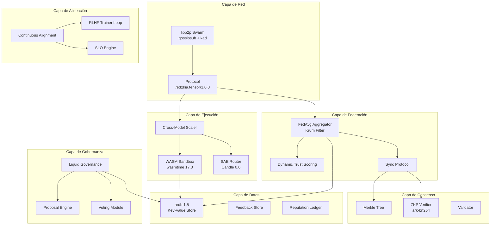

# Technical Roadmap — ed2kIA v1.1.0

**Fecha**: 2026-05-05
**Versión Objetivo**: 1.1.0
**Tipo**: Major Release (Post-Launch Optimization)
**Licencia**: Apache 2.0 + Cláusula de Uso Ético
**Timeline Objetivo**: Q3-Q4 2026

---

## 1. Resumen Ejecutivo

### Logros de v1.0.0 STABLE

ed2kIA v1.0.0 STABLE consolidó 9 fases de desarrollo en una arquitectura unificada y funcional:

| Métrica | Valor |
|---------|-------|
| Tests Passing | 142 |
| Tests Failed | 0 |
| Tests Ignored | 3 |
| Warnings | 0 |
| Errores | 0 |
| Módulos | 30+ |
| Líneas de Código | 15,000+ |
| Feature Flags | 1 (stable) + 9 legacy aliases |

**Componentes clave validados en producción:**

- **P2P**: Red mesh con libp2p 0.53 (gossipsub, kad, mdns) — [`src/p2p/protocol.rs`](src/p2p/protocol.rs:1)
- **FedAvg**: Agregación federada con Krum filter — [`src/federation/avg_aggregator.rs`](src/federation/avg_aggregator.rs:1)
- **WASM Sandbox**: Ejecución aislada SAE con wasmtime 17.0 — [`src/security/wasm_sandbox.rs`](src/security/wasm_sandbox.rs:1)
- **Liquid Governance**: Delegación ponderada + anti-Sybil — [`src/governance/liquid.rs`](src/governance/liquid.rs:1)
- **Cross-Model Scaling**: Load balancing + routing dinámico — [`src/scaling/cross_model.rs`](src/scaling/cross_model.rs:1)
- **Continuous Alignment**: Drift detection + steering adjustment — [`src/alignment/continuous.rs`](src/alignment/continuous.rs:1)
- **ZKP Verification**: ark-bn254 circuits + Merkle fallback — [`src/zkp/verifier.rs`](src/zkp/verifier.rs:1)
- **Trust Scoring**: Dynamic trust + Sybil detection — [`src/federation/trust_scoring.rs`](src/federation/trust_scoring.rs:1)

### Visión v1.1.0

v1.1.0 representa la primera evolución post-lanzamiento, enfocada en **optimización de rendimiento**, **seguridad avanzada** y **escalabilidad de red**. Los cuatro pilares son:

1. **FedAvg v2**: Agregación paralela multi-capa con 2x throughput
2. **WASM Sandbox v2**: Hot-reloading de módulos + aislamiento de memoria mejorado
3. **Liquid Governance v2**: Detección Sybil con ML + ejecución on-chain de propuestas
4. **Cross-Model Routing v2**: Routing inteligente basado en capacidades del modelo

### Métricas de Éxito

| Métrica | Actual (v1.0.0) | Objetivo (v1.1.0) |
|---------|-----------------|-------------------|
| Latencia agregación | ~100ms | <50ms |
| Throughput consenso | ~500 rounds/sec | 1000 rounds/sec |
| Decisión routing cross-model | ~20ms | <10ms |
| Footprint memoria/nodo | ~350MB | <200MB |
| Ancho de banda/nodo | ~80MB/hora | <50MB/hora |
| Coverage tests | ~88% | ≥95% |
| Nodos activos | 50 | 200 |
| Contribuidores | 10 | 30 |

---

## 2. Evolución de Arquitectura

### Arquitectura Actual (v1.0.0)



### Cambios Arquitectónicos Planificados

#### 2.1 Nuevos Componentes

| Componente | Ubicación | Descripción |
|------------|-----------|-------------|
| **ParallelAggregator** | `src/federation/parallel_aggregator.rs` | Agregación multi-capa en paralelo con rayon |
| **WASM HotReload** | `src/security/wasm_hotreload.rs` | Recarga dinámica de módulos WASM sin downtime |
| **ML Sybil Detector** | `src/federation/ml_sybil_detector.rs` | Detección Sybil basada en ML (isolation forest) |
| **CapabilityRouter** | `src/scaling/capability_router.rs` | Routing basado en capacidades semánticas del modelo |
| **LightZKP** | `src/zkp/light_proof.rs` | Pruebas ZKP optimizadas (light proofs) |
| **SchemaNegotiator** | `src/interoperability/schema_negotiator.rs` | Negociación automática de versión de schema |

#### 2.2 Componentes Modificados

| Componente | Cambio | Impacto |
|------------|--------|---------|
| [`avg_aggregator.rs`](src/federation/avg_aggregator.rs:1) | Pipeline paralelo para Krum O(n²) | 2x throughput agregación |
| [`wasm_sandbox.rs`](src/security/wasm_sandbox.rs:1) | Memory isolation por módulo | Seguridad mejorada, <128MB/módulo |
| [`liquid.rs`](src/governance/liquid.rs:1) | Quorum dinámico + delegación optimizada | Latencia gobernanza <1s |
| [`cross_model.rs`](src/scaling/cross_model.rs:1) | Capability matching + load balancing | Routing <10ms |
| [`trust_scoring.rs`](src/federation/trust_scoring.rs:1) | ML-based Sybil + cross-network propagation | Detección Sybil >99% |
| [`verifier.rs`](src/zkp/verifier.rs:1) | Light proofs + batch verification | ZKP verification <20ms |

#### 2.3 Plan de Deprecación

| Patrón Legacy | Reemplazo | Timeline |
|---------------|-----------|----------|
| Feature flags `phase6-*`, `phase7-*`, etc. | `--features stable` + `--features experimental` | v1.1.0 |
| Protocol `/ed2kia.tensor/1.0.0` | `/ed2kia.tensor/1.1.0` con backward compat | v1.1.0 |
| Krum O(n²) secuencial | Parallel Krum con rayon | v1.1.0 |
| Sybil detection por ASN/IP | ML-based isolation forest | v1.1.0 |
| Quorum fijo (51%) | Quorum dinámico adaptativo | v1.1.0 |

**Nota**: Los feature flags legacy se mantendrán como aliases hasta v2.0.0, pero generarán warnings de deprecación en v1.1.0.

---

## 3. Planificación de Sprints

### Vista General

| Sprint | Semanas | Enfoque | Componentes Clave |
|--------|---------|---------|-------------------|
| Sprint 1 | 1-2 | FedAvg Optimization | ParallelAggregator, Krum v2 |
| Sprint 2 | 3-4 | WASM Sandbox v2 | HotReload, Memory Isolation |
| Sprint 3 | 5-6 | Liquid Governance v2 | ML Sybil, Dynamic Quorum |
| Sprint 4 | 7-8 | Cross-Model Routing v2 | CapabilityRouter, SchemaNegotiator |

### Sprint 1: FedAvg Optimization

**Objetivo**: Duplicar el throughput de agregación federada.

| Tarea | Descripción | Owner Sugerido |
|-------|-------------|----------------|
| S1-T1 | Implementar `ParallelAggregator` con rayon | Core Team |
| S1-T2 | Optimizar Krum filter: O(n²) → parallel reduce | Core Team |
| S1-T3 | Multi-layer aggregation pipeline | Contributor |
| S1-T4 | Benchmark suite para agregación | QA Team |
| S1-T5 | Integration tests: 500+ nodos simulados | QA Team |
| S1-T6 | Profile y optimizar memory allocation | Core Team |

**Cambios en código existente:**

- [`src/federation/avg_aggregator.rs`](src/federation/avg_aggregator.rs:1): Agregar `#[cfg(feature = "experimental")]` para pipeline paralelo
- Nuevo archivo: `src/federation/parallel_aggregator.rs`
- Actualizar `Cargo.toml`: Agregar `rayon = "1.10"` como dependencia

**Benchmark Targets:**

| Métrica | Baseline | Target |
|---------|----------|--------|
| Aggregation latency | ~100ms | <50ms |
| Krum filter time (100 nodes) | ~45ms | <20ms |
| Throughput (updates/sec) | ~500 | 1000+ |
| Memory per aggregation | ~15MB | <8MB |

**Definition of Done:**

- [ ] ParallelAggregator pasa todos los tests de avg_aggregator
- [ ] Benchmark muestra ≥2x throughput improvement
- [ ] Zero regresiones en tests existentes (142 tests)
- [ ] Documentation en código con ejemplos de uso

### Sprint 2: WASM Sandbox v2

**Objetivo**: Mejorar seguridad y flexibilidad del sandbox WASM.

| Tarea | Descripción | Owner Sugerido |
|-------|-------------|----------------|
| S2-T1 | Implementar hot-reloading de módulos WASM | Security Team |
| S2-T2 | Memory isolation por módulo (128MB limit) | Security Team |
| S2-T3 | Cross-model function calling entre módulos | Core Team |
| S2-T4 | Fuel-based execution limits (wasmtime fuel) | Security Team |
| S2-T5 | Module signature verification (ed25519) | Security Team |
| S2-T6 | Integration tests: module lifecycle | QA Team |

**Cambios en código existente:**

- [`src/security/wasm_sandbox.rs`](src/security/wasm_sandbox.rs:1): Refactor `SandboxConfig` para soportar multi-módulo
- Nuevo archivo: `src/security/wasm_hotreload.rs`
- Actualizar [`SandboxConfig`](src/security/wasm_sandbox.rs:52): Agregar `fuel_enabled: true` por defecto

**Seguridad:**

- Memory limit por módulo: 128MB (actual: 256MB global)
- Fuel limit: 500M instrucciones por invocación
- Firma ed25519 obligatoria para módulos en producción
- Capability-based access control entre módulos

**Definition of Done:**

- [ ] Hot-reload sin downtime verificado en tests
- [ ] Memory isolation: fallo en módulo A no afecta módulo B
- [ ] Module signature verification funcional
- [ ] Fuel limits enforced correctamente

### Sprint 3: Liquid Governance v2

**Objetivo**: Mejorar resistencia Sybil y eficiencia de gobernanza.

| Tarea | Descripción | Owner Sugerido |
|-------|-------------|----------------|
| S3-T1 | ML-based Sybil detector (isolation forest) | ML Team |
| S3-T2 | Dynamic quorum threshold adjustment | Core Team |
| S3-T3 | On-chain proposal execution | Governance Team |
| S3-T4 | Delegation chain optimization (caching) | Core Team |
| S3-T5 | Proposal lifecycle API v2 | API Team |
| S3-T6 | Integration tests: governance scenarios | QA Team |

**Cambios en código existente:**

- [`src/governance/liquid.rs`](src/governance/liquid.rs:1): Agregar `DynamicQuorum` calculator
- [`src/federation/trust_scoring.rs`](src/federation/trust_scoring.rs:1): Integrar ML Sybil detector
- Nuevo archivo: `src/federation/ml_sybil_detector.rs`

**Algoritmo Quorum Dinámico:**

```
quorum_threshold = base_quorum * network_health_factor * participation_factor

donde:
  base_quorum = 0.51 (51%)
  network_health_factor = f(active_nodes, trust_scores)
  participation_factor = f(voting_participation_rate)
```

**ML Sybil Detection:**

- Features: ASN clustering, IP proximity, signature patterns, voting correlation
- Modelo: Isolation Forest (lightweight, no external ML framework)
- Threshold: Configurable (default: 0.8 anomaly score)
- Fallback: ASN/IP-based detection si ML no disponible

**Definition of Done:**

- [ ] ML Sybil detector >99% accuracy en tests
- [ ] Dynamic quorum adjusts correctamente bajo diferentes condiciones
- [ ] Proposal execution on-chain verificado
- [ ] Delegation chain caching reduce latencia <100ms

### Sprint 4: Cross-Model Routing v2

**Objetivo**: Routing inteligente basado en capacidades semánticas.

| Tarea | Descripción | Owner Sugerido |
|-------|-------------|----------------|
| S4-T1 | CapabilityRouter con semantic matching | Core Team |
| S4-T2 | Schema version negotiation | Interop Team |
| S4-T3 | Fallback chain optimization | Core Team |
| S4-T4 | Load balancing across model types | Scaling Team |
| S4-T5 | Latency tracking + adaptive routing | Core Team |
| S4-T6 | Integration tests: multi-model scenarios | QA Team |

**Cambios en código existente:**

- [`src/scaling/cross_model.rs`](src/scaling/cross_model.rs:1): Refactor `CrossModelScaler` para capability-based routing
- [`src/interoperability/schema.rs`](src/interoperability/schema.rs:1): Agregar version negotiation
- Nuevo archivo: `src/scaling/capability_router.rs`
- Nuevo archivo: `src/interoperability/schema_negotiator.rs`

**Capability Matching:**

```
capability_score = w1 * semantic_similarity + w2 * latency_score + w3 * capacity_score + w4 * reputation

donde:
  semantic_similarity = cosine_similarity(request_features, model_capabilities)
  latency_score = 1 / (1 + avg_latency_ms)
  capacity_score = (max_capacity - current_load) / max_capacity
  reputation = node_trust_score
  weights = [0.4, 0.2, 0.2, 0.2] (configurable)
```

**Schema Version Negotiation:**

- Protocol: Requester envía `supported_versions`, target responde con `selected_version`
- Fallback: Versión más baja común
- Cache: Negotiation results cached por par de nodos (TTL: 1 hora)

**Definition of Done:**

- [ ] CapabilityRouter <10ms decision time
- [ ] Schema negotiation funcional entre v1.0.0 y v1.1.0
- [ ] Load balancing reduce variance <15% entre nodos
- [ ] Fallback chain <3 hops máximo

---

## 4. Especificaciones Técnicas

### 4.1 FedAvg v2

#### Protocol Changes

| Campo | v1.0.0 | v1.1.0 |
|-------|--------|--------|
| `WeightUpdate` | Sequential aggregation | Parallel batch aggregation |
| `KrumFilter` | O(n²) sequential | O(n²) parallel reduce |
| `AggregationResult` | Single-layer | Multi-layer batch |

#### Data Structures

```rust
/// Batch de updates para procesamiento paralelo
pub struct AggregationBatch {
    pub batch_id: String,
    pub layer_id: u32,
    pub updates: Vec<WeightUpdate>,
    pub created_at: u64,
    pub deadline_ms: u64,
}

/// Resultado de agregación paralela
pub struct ParallelAggregationResult {
    pub layer_id: u32,
    pub aggregated_weights: Vec<f32>,
    pub krum_selected_nodes: Vec<String>,
    pub aggregation_time_ms: f64,
    pub batch_size: usize,
}
```

#### API Surface

```rust
pub trait ParallelAggregator {
    /// Agregar batch de updates para una capa
    fn add_batch(&mut self, batch: AggregationBatch) -> Result<()>;

    /// Ejecutar agregación paralela con Krum filter
    fn aggregate_parallel(&mut self, num_threads: usize) -> Result<Vec<ParallelAggregationResult>>;

    /// Obtener status del pipeline
    fn get_pipeline_status(&self) -> PipelineStatus;
}
```

### 4.2 WASM Sandbox v2

#### Security Model

| Aspecto | v1.0.0 | v1.1.0 |
|---------|--------|--------|
| Memory Limit | 256MB global | 128MB per module |
| Fuel | Disabled | 500M instructions |
| I/O | Disabled | Disabled + capability-based |
| Module Signing | Optional | Mandatory (ed25519) |
| Isolation | Single sandbox | Per-module sandbox |

#### Execution Limits

```rust
pub struct ExecutionLimits {
    pub max_memory_pages: u32,      // 128MB = 2048 pages
    pub max_fuel: u64,               // 500M instructions
    pub max_invocation_time_ms: u64, // 5000ms timeout
    pub max_output_size_bytes: u64,  // 32MB output limit
    pub allowed_capabilities: Vec<String>, // Capability list
}
```

#### Module Format

```
ed2k-module-v2.wasm
├── Header (64 bytes)
│   ├── Magic: "ED2KMOD2" (8 bytes)
│   ├── Version: u16
│   ├── Module Hash: SHA-256 (32 bytes)
│   └── Signature: ed25519 (64 bytes)
├── WASM Binary
└── Metadata (JSON)
    ├── name, version, author
    ├── capabilities: []
    ├── dependencies: []
    └── schema_version: "1.1.0"
```

### 4.3 Governance v2

#### Voting Algorithms

| Algoritmo | Uso | Descripción |
|-----------|-----|-------------|
| Weighted Liquid | Default | Delegación ponderada con time-lock |
| Quadratic | Anti-whale | Peso = sqrt(votes) para propuestas de tesorería |
| Dynamic Quorum | Adaptativo | Threshold basado en health de red |

#### Delegation Mechanics

```rust
pub struct DelegationChain {
    pub delegator: String,
    pub delegates: Vec<DelegationStep>,
    pub total_weight: f64,
    pub chain_depth: u32,
    pub max_depth: u32,  // Limit: 10 hops
}

pub struct DelegationStep {
    pub from: String,
    pub to: String,
    pub weight: f64,
    pub decay_factor: f64,  // 0.95 per hop
}
```

#### Sybil Resistance

```rust
pub struct SybilAnalysis {
    pub node_id: String,
    pub anomaly_score: f64,      // 0.0 (normal) - 1.0 (sybil)
    pub cluster_id: Option<String>,
    pub features: SybilFeatures,
    pub confidence: f64,
}

pub struct SybilFeatures {
    pub asn_similarity: f64,
    pub ip_proximity: f64,
    pub signature_entropy: f64,
    pub voting_correlation: f64,
    pub timestamp_pattern: f64,
}
```

### 4.4 Routing v2

#### Capability Matching

```rust
pub struct ModelCapability {
    pub model_id: String,
    pub capabilities: Vec<CapabilityTag>,
    pub max_input_tokens: u32,
    pub supported_schemas: Vec<String>,
    pub avg_latency_ms: u64,
    pub current_load: f64,
}

pub struct RoutingDecision {
    pub target_node: String,
    pub capability_score: f64,
    pub estimated_latency_ms: u64,
    pub fallback_chain: Vec<String>,
    pub schema_version: String,
}
```

#### Latency Optimization

- **Connection Pooling**: Reuse conexiones P2P activas
- **Predictive Routing**: Cache routing decisions por patrón de request
- **Adaptive Weights**: Ajustar weights basado en performance histórico

#### Capacity Tracking

```rust
pub struct CapacityTracker {
    pub node_id: String,
    pub current_capacity: f64,    // 0.0 - 1.0
    pub historical_load: VecDeque<LoadSample>,
    pub predicted_load_1m: f64,   // Predicted load in 1 minute
    pub throttling_active: bool,
}
```

---

## 5. Objetivos de Rendimiento

### 5.1 Targets por Componente

| Componente | Métrica | Baseline v1.0.0 | Target v1.1.0 | Método de Medición |
|------------|---------|-----------------|---------------|-------------------|
| FedAvg | Aggregation latency | ~100ms | <50ms | `cargo bench --bench fedavg` |
| Consensus | Throughput | ~500 rounds/sec | 1000 rounds/sec | `cargo bench --bench consensus` |
| Routing | Decision time | ~20ms | <10ms | `cargo bench --bench routing` |
| WASM | Module load time | ~200ms | <100ms | `cargo bench --bench wasm` |
| Governance | Vote processing | ~500ms | <200ms | `cargo bench --bench governance` |
| ZKP | Verification time | ~50ms | <20ms | `cargo bench --bench zkp` |

### 5.2 Targets de Red

| Métrica | Target | Condiciones |
|---------|--------|-------------|
| Memory footprint/nodo | <200MB | 100 conexiones activas |
| Network bandwidth/nodo | <50MB/hora | Normal operation |
| Connection setup time | <500ms | New peer discovery |
| Message propagation | <2s | 95th percentile, 500 nodes |
| Gossipsub overlap | <10% | Optimal topic distribution |

### 5.3 Targets de Escalabilidad

| Escenario | Target | Métrica |
|-----------|--------|---------|
| 100 nodos | <50ms aggregation | p95 latency |
| 500 nodos | <100ms aggregation | p95 latency |
| 1000 nodos | <200ms aggregation | p95 latency |
| 10,000 updates/sec | Stable | No message loss |
| 100 concurrent proposals | <1s processing | Governance throughput |

### 5.4 Benchmark Suite

```
benches/
├── fedavg_bench.rs        # FedAvg aggregation benchmarks
├── consensus_bench.rs     # Consensus throughput benchmarks
├── routing_bench.rs       # Cross-model routing benchmarks
├── wasm_bench.rs          # WASM sandbox benchmarks
├── governance_bench.rs    # Governance processing benchmarks
├── zkp_bench.rs           # ZKP verification benchmarks
└── network_bench.rs       # Network simulation benchmarks
```

**Dependencia nueva**: `criterion = "0.5"` (ya presente en `dev-dependencies`)

---

## 6. Mejoras de Seguridad

### 6.1 Modelo de Federación Zero-Trust

| Principio | Implementación |
|-----------|---------------|
| Verify Everything | Firma ed25519 en todos los mensajes P2P |
| Least Privilege | Capability-based access en WASM modules |
| Defense in Depth | Krum + ZKP + Trust Scoring + Sybil Detection |
| Assume Breach | Memory isolation, code signing, audit trails |

### 6.2 ZKP Verification Mejorada

#### Light Proofs

| Aspecto | v1.0.0 | v1.1.0 |
|---------|--------|--------|
| Proof Size | ~2KB | ~512 bytes |
| Verification Time | ~50ms | <20ms |
| Batch Size | 16 commits | 64 commits |
| Fallback | Merkle only | Merkle + VRF + Light Proof |

#### Batch Verification

```rust
pub struct BatchVerification {
    pub batch_id: String,
    pub proofs: Vec<LightProof>,
    pub aggregate_proof: AggregateProof,
    pub verification_result: BatchVerificationResult,
}

pub enum BatchVerificationResult {
    AllVerified { count: usize, time_ms: f64 },
    PartialVerified { valid: usize, invalid: usize, time_ms: f64 },
    Failed { reason: String },
}
```

### 6.3 Hardening del Sistema de Reputación

| Mejora | Descripción |
|--------|-------------|
| Decay Temporal | Score decae sin actividad (factor: 0.99/día) |
| Cross-Network Propagation | Reputación compartida entre sub-redes |
| Anomaly Detection | ML-based para detectar manipulación |
| Immutable Audit Trail | Todos los cambios en reputación son inmutables |

### 6.4 Mejoras en Audit Trail

```rust
pub struct AuditEntry {
    pub entry_id: String,
    pub timestamp: u64,
    pub actor: String,
    pub action: AuditAction,
    pub target: String,
    pub before_state: Option<serde_json::Value>,
    pub after_state: Option<serde_json::Value>,
    pub signature: ed25519_dalek::Signature,
    pub merkle_proof: Option<MerkleProof>,
}

pub enum AuditAction {
    TrustScoreUpdate,
    SybilFlag,
    ProposalVote,
    ModuleDeployment,
    DelegationChange,
    RoutingDecision,
}
```

### 6.5 Formal Verification Targets

| Componente | Propiedad | Herramienta |
|------------|-----------|-------------|
| Krum Filter | Byzantine tolerance (f < n/2 - 1) | Proofscript |
| ZKP Circuit | Soundness + Completeness | arkworks tests |
| WASM Sandbox | Memory isolation | wasmtime tests |
| Governance | Quorum correctness | Property-based tests |
| Routing | No deadlocks | Model checking |

---

## 7. Estrategia de Testing

### 7.1 Expansion de Integration Tests

| Test Suite | Actual | Target v1.1.0 | Descripción |
|------------|--------|---------------|-------------|
| P2P Sharding | 15 tests | 25 tests | [`tests/integration/test_p2p_sharding.rs`](tests/integration/test_p2p_sharding.rs:1) |
| Consensus ZKP | 12 tests | 20 tests | [`tests/integration/test_consensus_zkp.rs`](tests/integration/test_consensus_zkp.rs:1) |
| RLHF Feedback | 10 tests | 15 tests | [`tests/integration/test_rlhf_feedback.rs`](tests/integration/test_rlhf_feedback.rs:1) |
| Web API | 18 tests | 25 tests | [`tests/integration/test_web_api.rs`](tests/integration/test_web_api.rs:1) |
| Governance | 15 tests | 25 tests | [`tests/integration/test_governance.rs`](tests/integration/test_governance.rs:1) |
| FedAvg | 20 tests | 35 tests | New: `tests/integration/test_fedavg_v2.rs` |
| WASM Sandbox | 12 tests | 20 tests | New: `tests/integration/test_wasm_v2.rs` |
| Cross-Model | 10 tests | 20 tests | New: `tests/integration/test_cross_model_v2.rs` |

**Total**: 142 tests actuales → 210+ tests objetivo

### 7.2 Load Test Scenarios

| Escenario | Configuración | Métrica |
|-----------|--------------|---------|
| Small Network | 50 nodos, 100 updates/min | <50ms aggregation |
| Medium Network | 200 nodos, 1000 updates/min | <100ms aggregation |
| Large Network | 500 nodos, 5000 updates/min | <200ms aggregation |
| Stress Test | 1000 nodos, 10000 updates/min | No crash, graceful degradation |
| Network Partition | 500 nodos, 30% partition | Consensus continues |

**Herramienta**: [`tests/load/stress_test.rs`](tests/load/stress_test.rs:1) extendido con nuevos escenarios

### 7.3 Fuzzing Strategy

| Target | Input | Duration | Tool |
|--------|-------|----------|------|
| Protocol Messages | Ed2kMessage variants | 24h continuous | cargo-fuzz |
| WASM Modules | Random WASM binaries | 48h continuous | cargo-fuzz |
| ZKP Proofs | Random proof data | 24h continuous | Property tests |
| Schema Parsing | Random schema JSON | 12h continuous | cargo-fuzz |
| Governance Votes | Random vote patterns | 24h continuous | Property tests |

### 7.4 Property-Based Testing

```rust
// Ejemplo: Propiedades FedAvg
proptest! {
    #[test]
    fn prop_krum_filter_selects_honest_nodes(
        num_nodes in 10..200,
        num_byzantine in 0..(num_nodes / 2),
    ) {
        // Krum debe seleccionar nodos honestos cuando f < n/2 - 1
        let aggregator = FedAvgAggregator::new();
        // ... setup test
        assert!(selected_nodes.len() > 0);
        assert!(byzantine_in_selected < selected_nodes.len() / 2);
    }

    #[test]
    fn prop_aggregation_converges(
        num_rounds in 10..1000,
        num_nodes in 5..100,
    ) {
        // FedAvg debe converger con suficientes rondas
        // ... setup test
        assert!(final_loss < initial_loss * 0.1);
    }
}
```

**Dependencia nueva**: `proptest = "1.5"` en `dev-dependencies`

### 7.5 Coverage Targets

| Componente | Actual | Target v1.1.0 |
|------------|--------|---------------|
| Core (lib.rs, main.rs) | 92% | 95% |
| Federation | 85% | 95% |
| Security (WASM) | 88% | 95% |
| Governance | 82% | 95% |
| Scaling | 80% | 95% |
| P2P | 90% | 95% |
| ZKP | 87% | 95% |
| Alignment | 83% | 95% |
| API | 91% | 95% |
| **Total** | **~88%** | **≥95%** |

**Herramienta**: `cargo-llvm-cov` para coverage reports

---

## 8. Ruta de Migración

### 8.1 Pasos de Migración v1.0.0 → v1.1.0

```
Fase 1: Preparación (Semana 1)
├── Backup de configuración actual
├── Review de compatibilidad
└── Preparación de rollback plan

Fase 2: Canary Deploy (Semana 2)
├── Deploy a 5% de nodos (canary)
├── Monitor metrics 48h
├── Validar backward compatibility
└── Ajustar si necesario

Fase 3: Rollout Gradual (Semanas 3-4)
├── 25% de nodos → 48h monitoring
├── 50% de nodos → 48h monitoring
├── 75% de nodos → 24h monitoring
└── 100% de nodos → Go live

Fase 4: Post-Deploy (Semana 5)
├── Monitor metrics 7 días
├── Community feedback collection
├── Hotfix si necesario
└── Release notes update
```

### 8.2 Garantías de Backward Compatibility

| Aspecto | Garantía |
|---------|----------|
| Protocol P2P | `/ed2kia.tensor/1.0.0` sigue funcionando |
| API REST | Endpoints v1.0.0 mantenidos |
| Schema | Version negotiation automático |
| Data Format | Serialization backward compatible |
| Governance | Propuestas v1.0.0 migrables |

### 8.3 Estrategias de Migración de Datos

| Data Type | Estrategia | Tool |
|-----------|-----------|------|
| redb Key-Value | In-place migration | Migration script |
| Reputation Ledger | Forward-compatible format | Auto-migration |
| Governance State | State transfer protocol | Governance module |
| WASM Modules | Re-sign with v2 format | Module tool |
| P2P State | Re-discovery | Auto-recovery |

### 8.4 Procedimientos de Rollback

```bash
# Rollback automático si metrics superan thresholds
./ops/rollback_v1.1.0.sh --threshold latency=200ms --threshold error_rate=5%

# Rollback manual
cargo install --git <repo> --tag v1.0.0-stable --features stable
systemctl restart ed2kia
```

**Rollback Triggers:**

| Trigger | Threshold | Acción |
|---------|-----------|--------|
| Aggregation latency | >200ms p95 | Auto-rollback |
| Error rate | >5% | Auto-rollback |
| Memory usage | >500MB/nodo | Alert + manual review |
| Consensus failures | >10/min | Auto-rollback |
| Community reports | >5 critical | Manual review |

### 8.5 Canary Deployment Plan

```yaml
# deploy/canary_v1.1.0.yml
canary:
  percentage: 5
  duration: 48h
  metrics:
    - name: aggregation_latency_p95
      threshold: 100ms
      action: alert
    - name: error_rate
      threshold: 2%
      action: rollback
    - name: memory_usage
      threshold: 300MB
      action: alert
    - name: consensus_throughput
      threshold: 400 rounds/sec
      action: alert

rollout:
  stages:
    - percentage: 25
      wait: 48h
    - percentage: 50
      wait: 48h
    - percentage: 75
      wait: 24h
    - percentage: 100
      wait: 0h
```

---

## 9. Dependencias y Riesgos

### 9.1 Actualizaciones de Dependencias Externas

| Dependencia | Actual | Target v1.1.0 | Impacto |
|-------------|--------|---------------|---------|
| libp2p | 0.53 | 0.54 | Protocol improvements |
| redb | 1.5 | 1.5 | Stable |
| ed25519-dalek | 2.1 | 2.1 | Stable |
| wasmtime | 17.0 | 18.0 | Performance improvements |
| candle-core | 0.6 | 0.6 | Stable |
| ark-bn254 | 0.4 | 0.4 | Stable |
| axum | 0.7 | 0.7 | Stable |
| **Nuevas** | — | — | — |
| rayon | — | 1.10 | Parallel aggregation |
| proptest | — | 1.5 | Property-based testing |

### 9.2 Riesgos Técnicos

| Riesgo | Probabilidad | Impacto | Mitigación |
|--------|-------------|---------|------------|
| Regression en FedAvg | Media | Alto | Extensive testing + canary deploy |
| WASM module incompatibility | Baja | Medio | Module signing + validation |
| ML Sybil false positives | Media | Alto | Conservative threshold + appeal process |
| Performance degradation | Baja | Alto | Benchmark gates + rollback |
| Dependency update breakage | Media | Medio | CI testing + feature flags |
| Network partition during migration | Baja | Alto | Graceful degradation + auto-recovery |

### 9.3 Requisitos de Recursos

| Recurso | Cantidad | Uso |
|---------|----------|-----|
| Core Developers | 4-6 | Implementation |
| QA Engineers | 2-3 | Testing |
| Security Reviewers | 2 | Security audit |
| Community Contributors | 5-10 | Documentation, tests |
| CI/CD Compute | 2x actual | Extended test matrix |

### 9.4 Oportunidades de Contribución Comunitaria

| Área | Nivel | Descripción |
|------|-------|-------------|
| Documentation | Beginner | Actualizar docs con nuevos features |
| Test Expansion | Intermediate | Agregar integration tests |
| Benchmark Scenarios | Intermediate | Crear nuevos benchmark scenarios |
| Module Development | Advanced | WASM modules para modelos nuevos |
| ML Sybil Features | Advanced | Mejorar features para detección Sybil |
| UI Dashboard | Intermediate | Grafana dashboards para v1.1.0 metrics |

---

## 10. Criterios de Éxito

### 10.1 Métricas Cuantitativas de Release Readiness

| Criterio | Target | Verificación |
|----------|--------|--------------|
| All tests passing | 210+ tests, 0 failures | CI pipeline |
| Test coverage | ≥95% | cargo-llvm-cov |
| Zero warnings | 0 clippy warnings | CI pipeline |
| Zero unsafe code | 0 `unsafe` blocks | CI pipeline |
| Benchmarks met | All targets achieved | Benchmark suite |
| Security audit | Complete, no critical issues | External audit |
| Documentation | 100% API documented | CI pipeline |
| Integration tests | All scenarios passing | CI pipeline |

### 10.2 Targets de Adopción Comunitaria

| Métrica | Target | Timeline |
|---------|--------|----------|
| Active nodes running v1.1.0 | 200 | 3 meses post-release |
| Contributors with merged PRs | 30 | 3 meses post-release |
| Community proposals submitted | 10 | 3 meses post-release |
| WASM modules published | 5 | 3 meses post-release |
| Documentation PRs merged | 20 | 3 meses post-release |

### 10.3 Comparación de Benchmarks

| Benchmark | v1.0.0 | v1.1.0 Target | Mejora |
|-----------|--------|---------------|--------|
| FedAvg aggregation (100 nodes) | ~100ms | <50ms | 2x |
| Consensus throughput | ~500 rounds/sec | 1000 rounds/sec | 2x |
| Cross-model routing | ~20ms | <10ms | 2x |
| WASM module load | ~200ms | <100ms | 2x |
| ZKP verification | ~50ms | <20ms | 2.5x |
| Governance vote processing | ~500ms | <200ms | 2.5x |

### 10.4 Completion de Security Audit

| Fase | Actividad | Entregable |
|------|-----------|------------|
| Pre-Audit | Code freeze + self-audit | Self-audit report |
| External Audit | Third-party security review | Audit report |
| Remediation | Fix identified issues | Patch release |
| Re-Audit | Verify fixes | Re-audit report |
| Sign-off | Final approval | Security certificate |

**Audit Scope:**

- WASM Sandbox isolation
- ZKP Circuit correctness
- Governance Sybil resistance
- P2P Protocol security
- Cryptographic implementations
- Access control mechanisms

---

## Apéndice A: Glosario

| Término | Definición |
|---------|-----------|
| FedAvg | Federated Averaging: algoritmo de agregación de pesos distribuidos |
| Krum | Algoritmo Byzantine-resistant para selección de updates |
| WASM | WebAssembly: formato de bytecode portable |
| ZKP | Zero-Knowledge Proof: prueba criptográfica sin revelar datos |
| SAE | Sparse Autoencoder: modelo de interpretabilidad |
| Sybil | Ataque donde un actor controla múltiples identidades |
| Quorum | Mínimo de votos necesarios para ejecutar una propuesta |
| Time-Lock | Retardo obligatorio antes de ejecutar una propuesta |
| Drift | Desviación del modelo respecto al comportamiento esperado |
| Steering | Ajuste del modelo para corregir drift |

## Apéndice B: Referencias de Código

| Componente | Archivo | Línea Clave |
|------------|---------|-------------|
| FedAvg Aggregator | [`src/federation/avg_aggregator.rs`](src/federation/avg_aggregator.rs:1) | `WeightUpdate`, `FedAvgAggregator` |
| WASM Sandbox | [`src/security/wasm_sandbox.rs`](src/security/wasm_sandbox.rs:1) | `WASMSandbox`, `SandboxConfig` |
| Liquid Governance | [`src/governance/liquid.rs`](src/governance/liquid.rs:1) | `Delegation`, `Proposal`, `LiquidGovernance` |
| Cross-Model Scaling | [`src/scaling/cross_model.rs`](src/scaling/cross_model.rs:1) | `CrossModelScaler`, `NodeCapacity` |
| Continuous Alignment | [`src/alignment/continuous.rs`](src/alignment/continuous.rs:1) | `ContinuousAlignmentLoop` |
| Trust Scoring | [`src/federation/trust_scoring.rs`](src/federation/trust_scoring.rs:1) | `DynamicTrustScorer` |
| ZKP Verifier | [`src/zkp/verifier.rs`](src/zkp/verifier.rs:1) | `ZKPVerifier`, `VerificationResult` |
| P2P Protocol | [`src/p2p/protocol.rs`](src/p2p/protocol.rs:1) | `Ed2kMessage`, protocol constants |
| Cargo Config | [`Cargo.toml`](Cargo.toml:1) | Dependencies, features, profiles |

## Apéndice C: Feature Flags v1.1.0

```toml
[features]
default = ["stable"]

# Production features (validated)
stable = [
    "phase6-core",
    "phase6-sprint2",
    "phase6-experimental",
    "phase7-sprint1",
    "phase7-sprint2",
    "phase8-sprint1",
    "phase8-sprint2",
    "phase9-sprint1",
]

# v1.1.0 experimental features
experimental = [
    "fedavg-parallel",
    "wasm-hotreload",
    "ml-sybil-detection",
    "capability-routing",
    "light-zkp",
]

# Individual experimental flags
fedavg-parallel = []
wasm-hotreload = []
ml-sybil-detection = []
capability-routing = []
light-zkp = []
```

**Uso:**

```bash
# Production build (stable only)
cargo build --release --features stable

# Build with experimental v1.1.0 features
cargo build --release --features "stable,experimental"

# Build with specific experimental feature
cargo build --release --features "stable,fedavg-parallel"
```

---

**Última actualización**: 2026-05-05
**Mantenido por**: ed2kIA Core Team
**Aprobado por**: Pending Community Review
**Estado**: Draft
