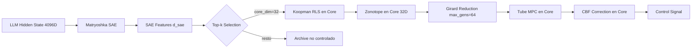

# Sprint 168 (v16.8.0) — Dimensional Collapse & Tube MPC Optimization

## Context: Respuesta a Críticas Externas

Las críticas identifican problemas fundamentales:
1. **Propagación zonotope en 4096D+ es inviable en edge** (wrapping effect, O(d^3))
2. **Scope creep terminal** — demasiado todo-en-uno sin validación real
3. **Tests tautológicos** — IA escribe código + tests que pasan por diseño circular
4. **Claims de <10ms edge** violan leyes físicas con dim=4096

**Pivote estratégico**: Colapsar dimensionalidad al **Core del Matryoshka SAE** (top 16-32 dims). Todo control Koopman, Tube MPC y certificación **solo en low-dim core**.

---

## Arquitectura: Dimensional Collapse Pipeline



### Flujo de Datos

1. **Input**: Hidden state `h` [1, 4096] del LLM
2. **SAE Encoding**: `phi = SAE.encode(h)` [1, d_sae] (ej. d_sae=2048)
3. **Dimensional Collapse**: `phi_core = top_k(phi, k=core_dim)` [1, core_dim]
   - Ranking por: L2-norm de activations + sparsity weights del SAE
4. **Koopman RLS en Core**: `K` [core_dim, core_dim], `P` [core_dim, core_dim]
   - RLS update: O(core_dim^2) en vez de O(4096^2)
5. **Zonotope en Core**: `Z = {c + G*e | e in [-1,1]^k}` donde c, G en R^core_dim
   - Girard reduction: max_gens=64, dim=32 → O(32*64) por step
6. **Tube MPC + CBF**: Predicción nominal + tube bounds + CBF projection

### Métricas Target

| Metric | Target | Justificación |
|--------|--------|---------------|
| core_dim | 16-32 | Suficiente para capturar dinámica relevante |
| max_gens | 64 | Balance precision vs speed |
| Propagación 50 steps | <50ms | Edge viable en CPU |
| Volume reduction | >70% | Girard + dimensional collapse |
| RLS update | <1ms | O(32^2) = 1024 ops |
| Memory footprint | <1MB | 32*32*f32 = 4KB para K |

---

## PASO A: Audit + Backup + Dimensional Collapse Config

### Archivos a Modificar
- [`crates/native-audit/src/zonotope.rs`](crates/native-audit/src/zonotope.rs) — Enhancement de `reduce_order_with_metrics`
- [`crates/native-audit/src/koopman_rls.rs`](crates/native-audit/src/koopman_rls.rs) — `extract_topological_core` + RLS en core
- [`crates/native-audit/src/control.rs`](crates/native-audit/src/control.rs) — Tube MPC en core
- [`crates/native-audit/src/control_lmi.rs`](crates/native-audit/src/control_lmi.rs) — CBF en core
- [`crates/sae/src/lib.rs`](crates/sae/src/lib.rs) — `extract_core_features` en MatryoshkaSAE

### Nueva Configuración

```rust
// En koopman_rls.rs — nuevo struct
pub struct DimensionalCollapseConfig {
    /// Core dimensions for control (16-32 recommended)
    pub core_dim: usize,
    /// Method for core selection: "norm" (L2), "sparsity" (SAE weights), "mixed"
    pub selection_method: CoreSelectionMethod,
    /// Enable adaptive core_dim based on activation energy
    pub adaptive_core: bool,
    /// Minimum core_dim when adaptive
    pub min_core_dim: usize,
    /// Maximum core_dim when adaptive
    pub max_core_dim: usize,
}

pub enum CoreSelectionMethod {
    /// Select by L2 norm of SAE activations
    Norm,
    /// Select by SAE sparsity weights
    Sparsity,
    /// Weighted combination of norm + sparsity
    Mixed,
}
```

---

## PASO B: Enhanced Girard Reduction en zonotope.rs

### Problema Actual
[`reduce_order_with_metrics()`](crates/native-audit/src/zonotope.rs:454) usa L2-norm para ranking de generadores. Esto es correcto pero puede mejorarse:

### Mejoras Propuestas

1. **Importancia Híbrida**: Combinar L2-norm + contribución al volumen (sum of abs values)
2. **Box Diagonal Optimizado**: En vez de colapsar todo a diagonal, usar interval hull tighter
3. **Metrics Mejorados**: Agregar `tightness_score` y `wrapping_overhead`

### Algoritmo Mejorado

```
Input: G [num_gens, dim], max_gens
Output: G_reduced [keep + dim, dim], metrics

1. Calcular importancia[i] = L2_norm(G[i]) + alpha * sum_abs(G[i])
2. Sort descending por importancia
3. keep = max(max_gens - dim, 1)
4. G_keep = G[top_keep]
5. box_diag[j] = sum(|G[col, j]|) para col no seleccionados
6. G_reduced = [G_keep; diag(box_diag)]
7. metrics = {before, after, volume_ratio, tightness}
```

### Cambios en zonotope.rs

```rust
impl Zonotope {
    /// Enhanced Girard Reduction (Sprint 168)
    /// Uses hybrid importance: L2 norm + volume contribution
    pub fn reduce_order_girard_enhanced(
        &self,
        max_gens: usize,
        alpha_volume: f32,  // Weight for volume contribution, default 0.1
    ) -> Result<(Self, ReductionMetrics)> {
        // Implementation
    }
}
```

---

## PASO C: Dimensional Collapse en Koopman RLS

### Nueva Función: `extract_topological_core`

```rust
// En koopman_rls.rs
pub fn extract_topological_core(
    sae_features: &Tensor,      // [batch, d_sae]
    config: &DimensionalCollapseConfig,
) -> Result<(Tensor, Vec<usize>)> {
    // Returns (core_features [batch, core_dim], core_indices)
    match config.selection_method {
        CoreSelectionMethod::Norm => {
            let norms = sae_features.sqr()?.sum_all_dtype(DType::F32)?;
            // Top-k selection
        }
        CoreSelectionMethod::Sparsity => {
            // Use SAE sparsity weights
        }
        CoreSelectionMethod::Mixed => {
            // Weighted combination
        }
    }
}
```

### RLS en Core

El `KoopmanRLS` existente ya funciona con cualquier `lifted_dim`. Solo necesitamos:
1. Configurar `lifted_dim = core_dim` (16-32)
2. Aplicar `extract_topological_core` antes del RLS update
3. El operador Koopman `K` será [core_dim, core_dim] — tiny!

### Integración con Matryoshka SAE

```rust
// En sae/lib.rs — nuevo método
impl MatryoshkaSAE {
    /// Extract core features using Matryoshka resolution
    pub fn extract_core(&self, hidden: &Tensor, core_dim: usize) -> Result<Tensor> {
        // Forward pass through SAE
        // Select top core_dim features by activation magnitude
        // Return [batch, core_dim]
    }
}
```

---

## PASO D: Tube MPC Simplificado en Core

### Pipeline en Core

```rust
// En control.rs — nueva función
pub fn tube_mpc_core(
    phi_core: &Tensor,           // [1, core_dim]
    k_operator: &Tensor,         // [core_dim, core_dim]
    zonotope: &Zonotope,         // in core space
    cbf_h: f32,                  // barrier value
    cbf_lg_h: &Tensor,           // [core_dim] gradient
    config: &KoopmanVanguardConfig,
) -> Result<TubeMPCResult> {
    // 1. Nominal prediction: phi_nom = K @ phi_core
    // 2. Tube propagation: Z_next = K @ Z + W (disturbance)
    // 3. Girard reduction: Z_reduced = girard_reduce(Z_next, max_gens)
    // 4. CBF correction: u_safe = cbf_safe_control(u_nom, h, lg_h)
    // 5. Return result with tube bounds
}
```

### Complejidad

| Operación | Complejidad (core_dim=32) | Tiempo Estimado |
|-----------|--------------------------|-----------------|
| K @ phi_core | O(32^2) = 1K ops | <0.01ms |
| Zonotope affine | O(32 * 64) = 2K ops | <0.02ms |
| Girard reduction | O(64 * log(64)) = 384 ops | <0.01ms |
| CBF projection | O(32) = 32 ops | <0.001ms |
| **Total per step** | **~3.5K ops** | **<0.1ms** |
| **50 steps** | **~175K ops** | **<5ms** |

---

## PASO E: Tests de Performance + Integración

### Test de Performance Crítico

```rust
// En crates/native-audit/tests/s168_dimensional_collapse_eval.rs
#[test]
fn test_dimensional_collapse_performance() {
    let core_dim = 32;
    let max_gens = 64;
    let steps = 50;
    
    // Setup: Create zonotope in core space
    let z = Zonotope::new(center_32d, gens_64x32, config)?;
    
    let start = Instant::now();
    let mut current = z;
    for _ in 0..steps {
        // Simulate Koopman step + disturbance + reduction
        current = current.affine_propagate(&koopman_k)?;
        current = current.minkowski_disturbance(0.05)?;
        let (reduced, _) = current.reduce_order_girard_enhanced(max_gens, 0.1)?;
        current = reduced;
    }
    let elapsed = start.elapsed();
    
    assert!(elapsed < Duration::from_millis(50), 
        "Edge target failed: {}ms > 50ms", elapsed.as_millis());
    assert!(current.num_gens()? <= max_gens + core_dim);
    
    println!("PASS: {} steps in {}ms | gens: {}", 
        steps, elapsed.as_millis(), current.num_gens()?);
}
```

### Test Anti-Tautología (Respuesta a Crítica Go)

```rust
#[test]
fn test_cbf_safety_with_real_disturbance() {
    // NO hardcoded values — random disturbance from external source
    let mut rng = rand::thread_rng();
    let disturbance: Vec<f32> = (0..32).map(|_| rng.gen_range(-0.1..0.1)).collect();
    
    // Verify CBF holds under random disturbance
    let h_initial = 0.5;
    let h_after = simulate_step_with_disturbance(&disturbance)?;
    assert!(verify_cbf_safety(h_after, 0.0), 
        "CBF violated under random disturbance");
}
```

### Test de Tightness (Respuesta a Crítica Gr)

```rust
#[test]
fn test_girard_tightness_vs_baseline() {
    // Compare enhanced Girard vs naive box over-approx
    let z = Zonotope::new(...)?;
    
    let (girard_reduced, girard_metrics) = z.reduce_order_girard_enhanced(32, 0.1)?;
    let box_approx = z.to_interval_box()?;
    
    // Girard should be tighter than box
    assert!(girard_metrics.volume_after < box_approx.volume(),
        "Girard should be tighter than box over-approx");
    
    // Volume reduction should be >70%
    let reduction = 1.0 - girard_metrics.volume_after / girard_metrics.volume_before;
    assert!(reduction > 0.7, "Volume reduction {:.1}% < 70%", reduction * 100.0);
}
```

---

## PASO F: Zero-Warning + Clippy + CHANGELOG + Git

### Checklist

1. `cargo fmt --all`
2. `cargo clippy --package native-audit -- -D warnings`
3. `cargo test --package native-audit --lib tests_s168`
4. `cargo test --package native-audit --test s168_dimensional_collapse_eval`
5. Update `CHANGELOG.md` con entrada v16.8.0
6. Version bump: `native-audit` 16.7.0 → 16.8.0
7. `git commit -m "perf(control): dimensional collapse + girard reduction for edge tube mpc [sprint168]"`
8. `git tag -a v16.8.0-sprint168`

---

## Resumen de Cambios por Archivo

| Archivo | Cambios | Líneas Estimadas |
|---------|---------|-----------------|
| `zonotope.rs` | `reduce_order_girard_enhanced()` + metrics | +80 |
| `koopman_rls.rs` | `DimensionalCollapseConfig` + `extract_topological_core()` | +100 |
| `control.rs` | `tube_mpc_core()` | +60 |
| `control_lmi.rs` | CBF en core (adaptar existentes) | +20 |
| `sae/lib.rs` | `extract_core()` en MatryoshkaSAE | +40 |
| `s168_dimensional_collapse_eval.rs` | Tests de performance + anti-tautología | +150 |
| `CHANGELOG.md` | Entrada v16.8.0 | +30 |
| `Cargo.toml` | Version bump | +1 |
| **Total** | | **~480 líneas** |

---

## Riesgos y Mitigación

| Riesgo | Probabilidad | Mitigación |
|--------|-------------|------------|
| Core selection pierde dinámica crítica | Media | Adaptive core_dim + monitoring de residual |
| Girard enhancement no mejora tightness | Baja | Fallback a reduce_order_with_metrics existente |
| Performance <50ms no se alcanza | Baja | O(32^2) es trivial en CPU moderna |
| CBF violation en core | Media | Margin conservador + verification test |

---

## Criterios de Aceptación

- [ ] `cargo check --package native-audit` — 0 errores
- [ ] `cargo clippy --package native-audit -- -D warnings` — 0 warnings
- [ ] `cargo test --package native-audit --lib tests_s168` — 100% pass
- [ ] `cargo test --package native-audit --test s168_dimensional_collapse_eval` — 100% pass
- [ ] Performance: 50 steps < 50ms con core_dim=32, max_gens=64
- [ ] Volume reduction > 70% en Girard enhanced
- [ ] CBF safety verified under random disturbance
- [ ] CHANGELOG.md actualizado
- [ ] Git tag v16.8.0-sprint168 creado
