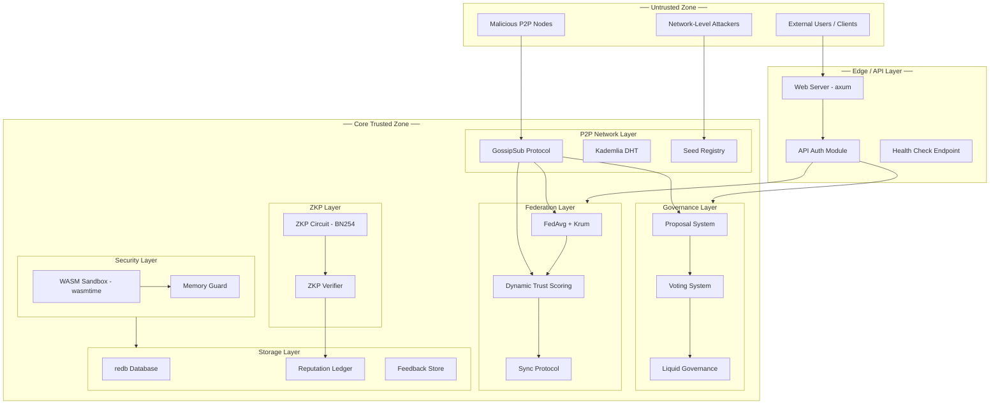

# Threat Model v1.1.0 - ed2kIA

> **Document Version:** 1.1
> **Date:** 2026-05-05
> **Status:** Draft - Pre-v1.1.0 Planning
> **Methodology:** STRIDE + DREAD
> **Scope:** ed2kIA v1.0.0 STABLE codebase, targeting v1.1.0 security enhancements

---

## 1. Threat Model Methodology

### 1.1 STRIDE Framework Adaptation

This threat model uses the **STRIDE** framework (Spoofing, Tampering, Repudiation, Information Disclosure, Denial of Service, Elevation of Privilege) adapted for decentralized P2P ML systems. Each threat category is mapped to ed2kIA components with specific mitigations and residual risk assessments.

### 1.2 DREAD Risk Scoring

Risk levels are calculated using **DREAD** (Damage, Reproducibility, Exploitability, Affected users, Discoverability):

| Factor | Scale | Description |
|--------|-------|-------------|
| **Damage** | 1-10 | Maximum damage if exploit succeeds |
| **Reproducibility** | 1-10 | How easily can the attack be repeated |
| **Exploitability** | 1-10 | Knowledge/resources needed to exploit |
| **Affected Users** | 1-10 | Percentage of network affected |
| **Discoverability** | 1-10 | How easy is it to find the vulnerability |

**Risk Score:** Average of all factors (max 10). Scores >=7 are Critical, 5-6 are High, 3-4 are Medium, 1-2 are Low.

### 1.3 Attack Surface Analysis Approach

- **Component-based:** Each system module analyzed independently
- **Data-flow-based:** Tracking sensitive data through system boundaries
- **Trust-boundary-based:** Identifying transitions between trusted/untrusted zones

---

## 2. System Architecture Overview

### 2.1 Component Diagram with Trust Boundaries



### 2.2 Data Flow Diagrams

**Governance Data Flow:**
```
Node -> Proposal (signed with ed25519) -> GossipSub -> Validation -> Ledger Storage
```

**Federated Learning Data Flow:**
```
Local Node -> Weight Delta (SHA-256 hashed) -> FedAvg + Krum Filter -> Aggregation -> ZKP Proof -> Distribution
```

**Feedback Data Flow:**
```
Human Annotator -> Feedback Entry -> Feedback Store (redb) -> Alignment Engine -> Model Update
```

### 2.3 External Interfaces and APIs

| Interface | Protocol | Trust Level | Authentication |
|-----------|----------|-------------|----------------|
| Web API | HTTP/WS | Untrusted | API key / Token |
| P2P Network | libp2p | Semi-trusted | Ed25519 identity |
| Health Check | HTTP | Untrusted | None |
| Bootstrap DNS | DNS | Untrusted | None |
| HuggingFace Sync | HTTPS | Semi-trusted | API token |

---

## 3. Asset Inventory

### 3.1 Critical Assets

| Asset | Location | Sensitivity | Protection |
|-------|----------|-------------|------------|
| **Private Keys** | Runtime memory, ed25519-dalek | Confidential | ed25519-dalek secure handling |
| **Seed Phrases** | External (user-managed) | Confidential | Not stored in binary |
| **ZKP Proofs** | [`src/zkp/circuit.rs`](src/zkp/circuit.rs:48) | Integrity | BN254 curve cryptography |
| **Reputation Data** | [`src/reputation/ledger.rs`](src/reputation/ledger.rs:68) | Integrity | Hash chain immutability |
| **WASM Module Cache** | [`src/security/wasm_sandbox.rs`](src/security/wasm_sandbox.rs:82) | Integrity | Sandbox isolation |

### 3.2 High-Value Assets

| Asset | Location | Sensitivity | Protection |
|-------|----------|-------------|------------|
| **Governance Proposals** | [`src/governance/proposal.rs`](src/governance/proposal.rs:97) | Integrity | Ed25519 signatures |
| **Feedback Data** | [`src/rlhf/feedback_store.rs`](src/rlhf/feedback_store.rs:44) | Confidential | Anonymized annotator IDs |
| **Model Weights** | [`src/federation/avg_aggregator.rs`](src/federation/avg_aggregator.rs:27) | Confidential | Delta-only transmission |
| **Trust Scores** | [`src/federation/trust_scoring.rs`](src/federation/trust_scoring.rs:50) | Integrity | Dynamic recalculation |

### 3.3 Medium-Value Assets

| Asset | Location | Sensitivity | Protection |
|-------|----------|-------------|------------|
| **Network Topology** | libp2p Kademlia DHT | Confidential | Peer rate limiting |
| **Peer Lists** | [`src/bootstrap/seed_registry.rs`](src/bootstrap/seed_registry.rs:79) | Confidential | Health check filtering |
| **Configuration** | `config.toml` | Integrity | File permissions |

### 3.4 Low-Value Assets

| Asset | Location | Sensitivity | Protection |
|-------|----------|-------------|------------|
| **Public Metrics** | [`src/monitoring/metrics.rs`](src/monitoring/metrics.rs) | Public | Prometheus exposure |
| **Documentation** | `docs/` | Public | N/A |
| **Logs** | `tracing` output | Internal | Log level control |

---

## 4. Threat Categories (STRIDE)

### 4.1 Spoofing

#### T-001: Fake Node Impersonation

**Description:** Attacker creates nodes with fake identities to participate in the network, gaining reputation and governance influence.

**Target Assets:** Node identity, reputation scores, governance voting

**Attack Vector:**
- Create multiple nodes with generated Ed25519 keypairs
- Join network via bootstrap seeds
- Accumulate reputation through legitimate-looking contributions

**Current Mitigations:**
- Ed25519 signature verification on all governance actions ([`src/governance/proposal.rs`](src/governance/proposal.rs:6))
- IP/ASN correlation for Sybil detection ([`src/federation/trust_scoring.rs`](src/federation/trust_scoring.rs:61))
- Anti-Sybil credit limits per IP/ASN ([`src/reputation/scoring.rs`](src/reputation/scoring.rs:51))
- Cryptographic signature binding in trust records ([`src/federation/trust_scoring.rs`](src/federation/trust_scoring.rs:65))

**DREAD Score:**
| Factor | Score | Rationale |
|--------|-------|-----------|
| Damage | 6 | Can influence governance if scale achieved |
| Reproducibility | 7 | Easy to generate keypairs |
| Exploitability | 5 | Requires understanding of detection mechanisms |
| Affected Users | 5 | Network-wide if governance compromised |
| Discoverability | 8 | Well-known attack pattern |
| **Average** | **6.2** | **High** |

**Residual Risk:** **Low** - Multiple layered mitigations make large-scale impersonation difficult

**v1.1.0 Enhancement:** ML-based Sybil detection using behavioral analysis

---

### 4.2 Tampering

#### T-002: Weight Update Manipulation in FedAvg

**Description:** Byzantine nodes submit malicious weight deltas to poison the aggregated federated model.

**Target Assets:** Model weights, FedAvg aggregation results

**Attack Vector:**
- Submit crafted weight deltas with adversarial gradients
- Exploit Krum filter by coordinating multiple Byzantine nodes
- Target specific model layers for maximum impact

**Current Mitigations:**
- Krum filter for Byzantine-resistant aggregation ([`src/federation/avg_aggregator.rs`](src/federation/avg_aggregator.rs:6))
- SHA-256 hash verification on weight updates ([`src/federation/avg_aggregator.rs`](src/federation/avg_aggregator.rs:67))
- ZKP verification for batch integrity ([`src/zkp/verifier.rs`](src/zkp/verifier.rs:1))
- Reputation-based node weighting ([`src/federation/trust_scoring.rs`](src/federation/trust_scoring.rs:9))

**Key Code:**
```rust
// src/federation/avg_aggregator.rs:6 - Krum filter
/// - apply_krum_filter(f) - Byzantine-resistant node selection
```

**DREAD Score:**
| Factor | Score | Rationale |
|--------|-------|-----------|
| Damage | 8 | Model quality degradation affects all users |
| Reproducibility | 6 | Requires ML expertise |
| Exploitability | 5 | Krum filter raises bar |
| Affected Users | 8 | All nodes using aggregated model |
| Discoverability | 6 | Known FL attack pattern |
| **Average** | **6.6** | **High** |

**Residual Risk:** **Low-Medium** - Krum filter effective against <33% Byzantine nodes

**v1.1.0 Enhancement:** Enhanced Krum with coordinate-wise median, Bulyan aggregation

---

### 4.3 Repudiation

#### T-003: Denial of Governance Actions

**Description:** Node claims it did not create a proposal or cast a vote, undermining governance accountability.

**Target Assets:** Governance proposals, voting records

**Attack Vector:**
- Create proposal, then deny authorship
- Claim vote was forged or manipulated
- Dispute delegation chain validity

**Current Mitigations:**
- Ed25519 signatures on all proposals ([`src/governance/proposal.rs`](src/governance/proposal.rs:6))
- Immutable reputation ledger with hash chains ([`src/reputation/ledger.rs`](src/reputation/ledger.rs:86))
- Vote records with timestamps and reputation snapshots ([`src/governance/voting.rs`](src/governance/voting.rs:58))
- Delegation chain tracking ([`src/governance/liquid.rs`](src/governance/liquid.rs:34))

**DREAD Score:**
| Factor | Score | Rationale |
|--------|-------|-----------|
| Damage | 4 | Governance disputes, not direct harm |
| Reproducibility | 3 | Cryptographic signatures prevent |
| Exploitability | 2 | Requires breaking Ed25519 |
| Affected Users | 4 | Governance participants |
| Discoverability | 5 | Obvious attack pattern |
| **Average** | **3.6** | **Medium** |

**Residual Risk:** **Low** - Cryptographic signatures provide non-repudiation

**v1.1.0 Enhancement:** Enhanced audit trail with Merkle proof of governance history

---

### 4.4 Information Disclosure

#### T-004: Model Weight Leakage

**Description:** Adversary extracts proprietary model weights or training data from federated updates.

**Target Assets:** Model weights, training data, gradient information

**Attack Vector:**
- Intercept weight deltas in transit
- Reconstruct training data from gradients (inversion attack)
- Analyze aggregated weights for member inference

**Current Mitigations:**
- Delta-only transmission (not full weights) ([`src/federation/avg_aggregator.rs`](src/federation/avg_aggregator.rs:31))
- SHA-256 integrity hashes ([`src/federation/avg_aggregator.rs`](src/federation/avg_aggregator.rs:39))
- ZKP proofs for batch verification ([`src/zkp/circuit.rs`](src/zkp/circuit.rs:35))
- libp2p Noise protocol for transport encryption

**DREAD Score:**
| Factor | Score | Rationale |
|--------|-------|-----------|
| Damage | 7 | IP theft, training data exposure |
| Reproducibility | 5 | Requires ML inversion expertise |
| Exploitability | 6 | Gradient attacks are known |
| Affected Users | 6 | Contributing nodes |
| Discoverability | 5 | Research-level attacks |
| **Average** | **5.8** | **Medium-High** |

**Residual Risk:** **Medium** - Gradient inference attacks remain theoretical threat

**v1.1.0 Enhancement:** Differential privacy noise injection, secure aggregation (SecAgg)

---

#### T-005: Feedback Data Exposure

**Description:** Annotator identity or feedback content leaked through feedback store exports.

**Target Assets:** Feedback entries, annotator metadata

**Attack Vector:**
- Access JSONL export files ([`src/rlhf/feedback_store.rs`](src/rlhf/feedback_store.rs:5))
- Query feedback store API endpoints
- Database file access on compromised node

**Current Mitigations:**
- Anonymized annotator IDs ([`src/rlhf/feedback_store.rs`](src/rlhf/feedback_store.rs:65))
- redb database file permissions
- No PII in feedback entries by design

**DREAD Score:**
| Factor | Score | Rationale |
|--------|-------|-----------|
| Damage | 5 | Privacy violation for annotators |
| Reproducibility | 6 | Direct file access |
| Exploitability | 7 | No encryption at rest |
| Affected Users | 3 | Annotators only |
| Discoverability | 6 | Standard data breach |
| **Average** | **5.4** | **Medium** |

**Residual Risk:** **Medium** - No encryption at rest for redb database

**v1.1.0 Enhancement:** AES-256-GCM encryption at rest, access control on exports

---

### 4.5 Denial of Service

#### T-006: Network Flooding

**Description:** Attacker floods the P2P network with invalid messages, exhausting resources.

**Target Assets:** Network bandwidth, CPU, memory

**Attack Vector:**
- Send high-volume GossipSub messages
- Flood Kademlia DHT with invalid records
- Exhaust peer connection limits

**Current Mitigations:**
- libp2p built-in rate limiting
- Peer reputation scoring ([`src/reputation/scoring.rs`](src/reputation/scoring.rs:1))
- Connection limits in libp2p swarm
- Memory guard for WASM sandbox ([`src/security/memory_guard.rs`](src/security/memory_guard.rs:1))

**DREAD Score:**
| Factor | Score | Rationale |
|--------|-------|-----------|
| Damage | 6 | Network degradation |
| Reproducibility | 8 | Easy to execute |
| Exploitability | 8 | Low skill required |
| Affected Users | 7 | All network participants |
| Discoverability | 9 | Well-known attack |
| **Average** | **7.6** | **Critical** |

**Residual Risk:** **Medium** - libp2p mitigations effective but not complete

**v1.1.0 Enhancement:** Token bucket rate limiting, adaptive peer scoring

---

#### T-007: Resource Exhaustion via WASM Modules

**Description:** Malicious WASM module consumes excessive memory or CPU.

**Target Assets:** Node resources, sandbox stability

**Attack Vector:**
- Load WASM module with infinite loop
- Allocate maximum memory pages
- Trigger memory guard bypass

**Current Mitigations:**
- 256MB memory limit ([`src/security/wasm_sandbox.rs`](src/security/wasm_sandbox.rs:18))
- 10MB module size limit ([`src/security/wasm_sandbox.rs`](src/security/wasm_sandbox.rs:137))
- Fuel limit (1B instructions) ([`src/security/wasm_sandbox.rs`](src/security/wasm_sandbox.rs:70))
- Memory guard pre-allocation checks ([`src/security/memory_guard.rs`](src/security/memory_guard.rs:59))

**DREAD Score:**
| Factor | Score | Rationale |
|--------|-------|-----------|
| Damage | 5 | Single node impact |
| Reproducibility | 6 | Requires malicious module |
| Exploitability | 4 | Multiple limits in place |
| Affected Users | 2 | Loading node only |
| Discoverability | 7 | Standard sandbox attack |
| **Average** | **4.8** | **Medium** |

**Residual Risk:** **Low** - Multiple layered limits

**v1.1.0 Enhancement:** Per-module resource quotas, automatic eviction

---

### 4.6 Elevation of Privilege

#### T-008: Governance Takeover via Sybil Attack

**Description:** Attacker gains control of governance voting through Sybil identities.

**Target Assets:** Governance decisions, network parameters

**Attack Vector:**
- Create many nodes (Sybil identities)
- Accumulate reputation across identities
- Coordinate voting to pass malicious proposals
- Exploit delegation mechanisms

**Current Mitigations:**
- Sybil detection via IP/ASN correlation ([`src/federation/trust_scoring.rs`](src/federation/trust_scoring.rs:61))
- Staking requirements for governance ([`src/governance/liquid.rs`](src/governance/liquid.rs:98))
- Delegation limits ([`src/governance/liquid.rs`](src/governance/liquid.rs:34))
- Anti-Sybil credit limits ([`src/reputation/scoring.rs`](src/reputation/scoring.rs:72))
- Minimum reputation threshold (0.7) for governance ([`src/reputation/scoring.rs`](src/reputation/scoring.rs:74))

**DREAD Score:**
| Factor | Score | Rationale |
|--------|-------|-----------|
| Damage | 9 | Full governance control |
| Reproducibility | 4 | Requires significant resources |
| Exploitability | 5 | Detection mechanisms in place |
| Affected Users | 10 | Entire network |
| Discoverability | 6 | Known attack pattern |
| **Average** | **6.8** | **High** |

**Residual Risk:** **Low-Medium** - Multi-layered Sybil resistance

**v1.1.0 Enhancement:** ML-based Sybil detection, proof-of-personhood integration

---

#### T-009: WASM Sandbox Escape

**Description:** Malicious WASM module escapes sandbox to execute arbitrary host code.

**Target Assets:** Host system, node integrity

**Attack Vector:**
- Exploit wasmtime vulnerability
- Abuse host function exposure
- Memory corruption via bounds check bypass

**Current Mitigations:**
- wasmtime 17.0 (audited by Bytecode Alliance)
- `wasm_reference_types(false)` prevents reference escapes ([`src/security/wasm_sandbox.rs`](src/security/wasm_sandbox.rs:94))
- Memory guard with bounds checking ([`src/security/memory_guard.rs`](src/security/memory_guard.rs:1))
- Minimal host function exposure
- Module safety validation ([`src/security/wasm_sandbox.rs`](src/security/wasm_sandbox.rs:149))

**DREAD Score:**
| Factor | Score | Rationale |
|--------|-------|-----------|
| Damage | 10 | Full node compromise |
| Reproducibility | 2 | Requires wasmtime 0-day |
| Exploitability | 2 | Extremely difficult |
| Affected Users | 3 | Loading node only |
| Discoverability | 3 | Hard to find |
| **Average** | **4.0** | **Medium** |

**Residual Risk:** **Low** - wasmtime is well-audited, minimal attack surface

**v1.1.0 Enhancement:** Formal verification of host function interfaces

---

## 5. Attack Scenarios

### Scenario 1: Byzantine FedAvg Attack

**Actor:** Malicious federated node operator

**Goal:** Poison aggregated model weights to degrade model quality or inject backdoor

**Preconditions:**
- Attacker controls >=1 federated node
- Knowledge of FedAvg aggregation protocol
- Access to adversarial training data

**Attack Steps:**
1. Train local model on poisoned data
2. Compute adversarial weight deltas
3. Submit deltas via [`src/federation/avg_aggregator.rs`](src/federation/avg_aggregator.rs:27) `WeightUpdate`
4. Attempt to bypass Krum filter by keeping deltas within normal range
5. Repeat over multiple rounds for cumulative effect

**Detection Mechanisms:**
- Krum filter outlier detection ([`src/federation/avg_aggregator.rs`](src/federation/avg_aggregator.rs:6))
- Reputation degradation for inconsistent updates ([`src/federation/trust_scoring.rs`](src/federation/trust_scoring.rs:67))
- SHA-256 hash verification ([`src/federation/avg_aggregator.rs`](src/federation/avg_aggregator.rs:77))

**Impact:**
- Model quality degradation (accuracy loss)
- Potential backdoor activation on specific inputs
- Trust erosion in federated model

**Likelihood:** **Low** - Requires >33% Byzantine nodes to bypass Krum

**Mitigation Status:** **Active** - Krum filter, reputation scoring, ZKP verification

---

### Scenario 2: Sybil Governance Attack

**Actor:** Adversary with resources to create multiple identities

**Goal:** Control governance voting to pass malicious proposals

**Preconditions:**
- Ability to run multiple nodes (VPS infrastructure)
- Knowledge of reputation accumulation mechanics
- Time to build reputation across identities

**Attack Steps:**
1. Deploy N nodes across diverse IP ranges (residential proxies)
2. Accumulate reputation through legitimate contributions
3. Build delegation chains to amplify voting power
4. Coordinate voting on target proposal
5. Execute proposal after time-lock expires

**Detection Mechanisms:**
- IP/ASN correlation ([`src/federation/trust_scoring.rs`](src/federation/trust_scoring.rs:61))
- Behavioral analysis via trust scoring ([`src/federation/trust_scoring.rs`](src/federation/trust_scoring.rs:9))
- Sybil cluster detection ([`src/governance/liquid.rs`](src/governance/liquid.rs:21))
- Staking requirements ([`src/governance/liquid.rs`](src/governance/liquid.rs:98))

**Impact:**
- Governance manipulation (parameter changes, model updates)
- Network policy changes
- Potential fund theft if economic mechanisms exist

**Likelihood:** **Low-Medium** - Resource-intensive but feasible

**Mitigation Status:** **Active** - Multi-layered Sybil resistance

---

### Scenario 3: Network Partition Exploit

**Actor:** Network-level attacker (ISP, nation-state)

**Goal:** Create conflicting consensus states in isolated partitions

**Preconditions:**
- Ability to partition network (BGP hijack, firewall)
- Control of nodes in at least one partition
- Knowledge of consensus mechanism

**Attack Steps:**
1. Isolate subset of nodes from main network
2. Manipulate governance or reputation in isolated partition
3. Create conflicting proposals or reputation states
4. Wait for partition healing
5. Exploit inconsistency during reconciliation

**Detection Mechanisms:**
- Chain integrity verification on reconnection
- Hash chain validation in reputation ledger ([`src/reputation/ledger.rs`](src/reputation/ledger.rs:86))
- Proposal state reconciliation

**Impact:**
- Temporary inconsistency in governance state
- Reputation score discrepancies
- Potential double-voting if not detected

**Likelihood:** **Medium** - Network partitions are realistic

**Mitigation Status:** **Partial** - Reconciliation mechanisms exist but not fully tested

---

### Scenario 4: WASM Sandbox Escape

**Actor:** Malicious module author

**Goal:** Execute arbitrary code on host node

**Preconditions:**
- Ability to create and distribute WASM modules
- Knowledge of wasmtime internals
- Vulnerability in wasmtime or host function interface

**Attack Steps:**
1. Craft malicious WASM module
2. Exploit memory safety vulnerability in wasmtime
3. Or: Abuse host function to access filesystem/network
4. Execute payload on host system
5. Pivot to compromise other network nodes

**Detection Mechanisms:**
- Memory isolation via wasmtime Cranelift
- Capability-based access control
- Memory guard escape detection ([`src/security/memory_guard.rs`](src/security/memory_guard.rs:29))
- Module safety validation ([`src/security/wasm_sandbox.rs`](src/security/wasm_sandbox.rs:149))

**Impact:**
- Full node compromise
- Private key theft
- Network-wide propagation if node is seed

**Likelihood:** **Low** - wasmtime is well-audited, minimal host functions

**Mitigation Status:** **Active** - wasmtime sandbox, memory guard, minimal host exposure

---

### Scenario 5: Feedback Poisoning

**Actor:** Adversarial user or automated bot

**Goal:** Corrupt RLHF alignment by submitting malicious feedback at scale

**Preconditions:**
- Access to feedback submission interface
- Knowledge of alignment mechanism
- Ability to submit at scale

**Attack Steps:**
1. Identify target features or concepts
2. Submit malicious feedback (approve bad, reject good)
3. Scale submissions to influence alignment scorer
4. Exploit drift thresholds to push model off-alignment
5. Repeat across multiple annotator IDs

**Detection Mechanisms:**
- Rate limiting on feedback submission
- Annotator reputation tracking ([`src/rlhf/feedback_store.rs`](src/rlhf/feedback_store.rs:21))
- Drift thresholds in alignment engine ([`src/alignment/engine.rs`](src/alignment/engine.rs:1))
- Feedback loop validation ([`src/alignment/feedback_loop.rs`](src/alignment/feedback_loop.rs:1))

**Impact:**
- Model misalignment with human values
- Degraded interpretation quality
- Potential harmful output generation

**Likelihood:** **Medium** - Low barrier to entry

**Mitigation Status:** **Active** - Rate limiting, annotator reputation, drift thresholds

---

## 6. Risk Matrix

### 6.1 Consolidated Risk Register

| ID | Threat | Impact | Likelihood | Risk Level | DREAD | Mitigation Status | v1.1.0 Action |
|----|--------|--------|------------|------------|-------|-------------------|---------------|
| T-001 | Fake Node Impersonation | Medium | Low | **Low** | 6.2 | Active (ed25519, Sybil detection) | ML Sybil detection |
| T-002 | Byzantine FedAvg | High | Low | **Medium** | 6.6 | Active (Krum filter) | Enhanced Krum + Bulyan |
| T-003 | Governance Repudiation | Low | Very Low | **Low** | 3.6 | Active (Signatures, Ledger) | Enhanced audit trail |
| T-004 | Model Weight Leakage | High | Medium | **Medium** | 5.8 | Partial (Delta-only, Noise) | Differential privacy |
| T-005 | Feedback Data Exposure | Medium | Medium | **Medium** | 5.4 | Partial (Anonymization) | Encryption at rest |
| T-006 | Network Flooding DoS | High | High | **High** | 7.6 | Active (libp2p limits) | Token bucket rate limit |
| T-007 | WASM Resource Exhaustion | Medium | Low | **Low** | 4.8 | Active (Memory guard) | Per-module quotas |
| T-008 | Sybil Governance Takeover | Critical | Low | **Medium** | 6.8 | Active (Multi-layer) | Proof-of-personhood |
| T-009 | WASM Sandbox Escape | Critical | Very Low | **Low** | 4.0 | Active (wasmtime) | Formal verification |

### 6.2 Risk Heat Map

```
Impact
 High  | T-002  | T-004  | T-006  |        |
       | (Med)  | (Med)  | (High) |        |
 Med   | T-001  | T-005  | T-008  | T-007  |
       | (Low)  | (Med)  | (Med)  | (Low)  |
 Low   | T-003  |        |        | T-009  |
       | (Low)  |        |        | (Low)  |
       +--------+--------+--------+--------+--------+
        Very    Low      Medium   High     Very
        Low                    Likelihood
```

### 6.3 Risk Trend Analysis

| Threat | Current | Trend | Notes |
|--------|---------|-------|-------|
| T-001 Sybil | Low | Improving | v1.1.0 ML detection will further reduce |
| T-002 Byzantine FL | Medium | Stable | Krum effective; enhanced methods planned |
| T-004 Weight Leakage | Medium | Worsening | Gradient attacks improving; DP needed |
| T-006 DoS | High | Stable | Standard P2P challenge |
| T-008 Governance | Medium | Improving | PoP integration will significantly reduce |

---

## 7. v1.1.0 Security Enhancements

### 7.1 Zero-Trust Federation Model

**Objective:** Eliminate implicit trust assumptions in federated learning.

**Components:**
- Mutual authentication for all federation peers
- Per-message signature verification
- Continuous trust score evaluation
- Automatic peer ejection on trust threshold breach

**Related Code:** [`src/federation/trust_scoring.rs`](src/federation/trust_scoring.rs:1)

### 7.2 ML-Based Sybil Detection

**Objective:** Detect Sybil clusters using machine learning.

**Components:**
- Behavioral feature extraction (contribution patterns, timing, network topology)
- Isolation forest for anomaly detection
- Graph-based cluster analysis
- Real-time scoring integration with governance

**Related Code:** [`src/governance/liquid.rs`](src/governance/liquid.rs:21), [`src/federation/trust_scoring.rs`](src/federation/trust_scoring.rs:36)

### 7.3 Enhanced ZKP (Light Proofs)

**Objective:** Reduce ZKP proof size and verification time.

**Components:**
- Optimized BN254 circuit compilation
- Proof aggregation for batch verification
- Light client verification mode
- Formal verification of circuit correctness

**Related Code:** [`src/zkp/circuit.rs`](src/zkp/circuit.rs:1), [`src/zkp/verifier.rs`](src/zkp/verifier.rs:1)

### 7.4 Formal Verification Targets

**Objective:** Mathematically verify critical security properties.

**Targets:**
- WASM sandbox isolation (wasmtime host functions)
- ZKP circuit soundness
- Governance state machine correctness
- Memory guard bounds checking

**Tools:**
- Kani (Rust formal verification)
- Creusot (Dafny-based verification)
- ProVerif (protocol analysis)

### 7.5 Improved Audit Trail

**Objective:** Comprehensive, tamper-evident audit logging.

**Components:**
- Merkle tree of all governance actions
- Cryptographic log signatures
- Immutable event store
- Exportable audit reports

**Related Code:** [`src/reputation/ledger.rs`](src/reputation/ledger.rs:1)

### 7.6 Encryption at Rest

**Objective:** Protect sensitive data stored in redb databases.

**Components:**
- AES-256-GCM encryption for database files
- Key derivation from master key
- Transparent encryption/decryption
- Key rotation support

**Related Code:** [`src/rlhf/feedback_store.rs`](src/rlhf/feedback_store.rs:14), [`src/reputation/ledger.rs`](src/reputation/ledger.rs:6)

### 7.7 Differential Privacy for Federated Learning

**Objective:** Prevent gradient inversion attacks.

**Components:**
- Calibrated Gaussian noise injection
- Privacy budget tracking (epsilon-delta)
- Per-layer noise scaling
- Privacy accounting dashboard

**Related Code:** [`src/federation/avg_aggregator.rs`](src/federation/avg_aggregator.rs:1)

---

## 8. Monitoring and Detection

### 8.1 Prometheus Metrics for Security Events

**Existing Metrics** ([`src/monitoring/metrics.rs`](src/monitoring/metrics.rs)):
- `wasm_sandbox_errors_total` - WASM sandbox failures
- `feedback_store_entries` - Feedback store size

**Planned Metrics:**
- `governance_proposals_total` - Proposal creation rate
- `sybil_detection_alerts_total` - Sybil detection events
- `trust_score_degradation_total` - Trust score drops
- `zkp_verification_failures_total` - ZKP verification failures
- `p2p_rejected_messages_total` - Rejected P2P messages
- `memory_guard_escapes_total` - Memory escape attempts

### 8.2 Anomaly Detection Thresholds

| Metric | Threshold | Action |
|--------|-----------|--------|
| Trust score drop | >0.3 in 1h | Alert + investigation |
| Sybil cluster size | >5 nodes | Auto-flag + review |
| ZKP verification failure rate | >5% in 1h | Alert + fallback to Merkle |
| Feedback submission rate | >100/min per annotator | Rate limit + review |
| WASM sandbox errors | >10/min | Alert + module quarantine |
| P2P message rejection rate | >20% | Peer score degradation |

### 8.3 Alert Rules Configuration

**Location:** [`ops/monitoring/alert_rules_v2.yml`](ops/monitoring/alert_rules_v2.yml)

**Security Alert Rules:**
```yaml
- alert: SybilClusterDetected
  expr: sybil_cluster_size > 5
  for: 5m
  labels:
    severity: warning
  annotations:
    summary: "Potential Sybil cluster detected (size: {{ $value }})"

- alert: TrustScoreCollapse
  expr: rate(trust_score_degradation_total[1h]) > 0.3
  for: 10m
  labels:
    severity: critical
  annotations:
    summary: "Rapid trust score degradation detected"

- alert: WASMSandboxEscapeAttempt
  expr: increase(memory_guard_escapes_total[5m]) > 0
  for: 1m
  labels:
    severity: critical
  annotations:
    summary: "WASM sandbox escape attempt detected"
```

### 8.4 Incident Response Procedures

**Severity 1 (Critical):**
1. Isolate affected node
2. Preserve forensic evidence
3. Notify security team
4. Activate incident response plan
5. Patch and verify
6. Post-incident review

**Severity 2 (High):**
1. Identify scope of impact
2. Apply temporary mitigation
3. Develop permanent fix
4. Deploy and verify
5. Document lessons learned

**Severity 3-4 (Medium-Low):**
1. Log and triage
2. Schedule fix in next sprint
3. Monitor for escalation

---

## 9. Compliance and Standards

### 9.1 OWASP API Security Top 10 Alignment

| OWASP Control | ed2kIA Implementation | Status |
|---------------|----------------------|--------|
| API1:2023 Broken Object Level Authorization | Annotator ID isolation in feedback store | Partial |
| API2:2023 Broken Authentication | Ed25519 signatures for governance | Compliant |
| API3:2023 Broken Object Property Level Authorization | Field-level access in API responses | Planned v1.1.0 |
| API4:2023 Unrestricted Resource Consumption | Memory guard, rate limiting | Partial |
| API5:2023 Broken Function Level Authorization | Capability-based WASM sandbox | Compliant |
| API6:2023 Unrestricted Access to Sensitive Business Flows | Governance time-lock, quorum | Compliant |
| API7:2023 Server Side Request Forgery | No SSRF vectors in P2P design | Compliant |
| API8:2023 Security Misconfiguration | Hardened defaults, feature flags | Partial |
| API9:2023 Improper Inventory of Third-Party Components | Cargo audit, pinned deps | Partial |
| API10:2023 Unsafe Consumption of APIs | Input validation on all APIs | Partial |

### 9.2 NIST SP 800-53 Controls Mapping

| Control Family | Key Controls | Status |
|----------------|--------------|--------|
| **AC - Access Control** | AC-2 (Account Management), AC-3 (Access Enforcement) | Partial |
| **AU - Audit** | AU-2 (Audit Events), AU-3 (Audit Content) | Partial |
| **CA - Assessment** | CA-3 (System-Generated Evidence) | Planned |
| **CM - Configuration** | CM-2 (Baseline Configuration), CM-8 (Inventory) | Compliant |
| **CP - Contingency** | CP-9 (System Recovery) | Partial |
| **IA - Identification** | IA-2 (Identification and Authentication) | Compliant (Ed25519) |
| **IR - Incident Response** | IR-4 (Incident Handling) | Partial |
| **MA - Maintenance** | MA-4 (Nonlocal Maintenance) | N/A (P2P) |
| **MP - Media Protection** | MP-6 (Media Sanitization) | Planned v1.1.0 |
| **PE - Physical** | PE-1 (Physical Access) | N/A (Distributed) |
| **PL - Planning** | PL-8 (Information Security Architecture) | Compliant |
| **PS - Personnel** | PS-1 (Personnel Screening) | N/A (Open source) |
| **RA - Risk Assessment** | RA-5 (Vulnerability Monitoring) | Partial |
| **SA - System Acquisition** | SA-22 (External Software Services) | Partial |
| **SC - System Communications** | SC-8 (Transmission Confidentiality) | Compliant (Noise protocol) |
| **SI - System and Info Integrity** | SI-11 (Error Handling), SI-16 (Memory Protection) | Compliant |

### 9.3 Cryptographic Standards

| Primitive | Standard | Implementation | Compliance |
|-----------|----------|----------------|------------|
| Ed25519 Signatures | NIST FIPS 186-5 (ECDSA analog), RFC 8032 | ed25519-dalek 2.1 | Compliant |
| SHA-256 Hashing | NIST FIPS 180-4 | sha2 0.10 | Compliant |
| BN254 Elliptic Curve | IETF draft-irtf-cfrg-pairing-friendly-curves | ark-bn254 0.4 | Compliant |
| Noise Protocol | Noise Protocol Framework | libp2p 0.53 | Compliant |
| AES-256-GCM (Planned) | NIST FIPS 197, NIST SP 800-38D | Planned v1.1.0 | Planned |

---

## Appendix A: Threat Model Assumptions

1. **Adversary Model:** Rational adversary with moderate resources (nation-state or well-funded organization)
2. **Threat Model Scope:** Software-level threats only (no physical attacks, side-channel attacks)
3. **Trust Assumptions:** Rust standard library and compiler are trusted
4. **Network Model:** Partially synchronous network (per consensus literature)
5. **Byzantine Threshold:** <33% Byzantine nodes for FedAvg safety (Krum guarantee)
6. **Cryptographic Assumptions:** Ed25519, SHA-256, BN254 pairings are computationally secure

## Appendix B: Revision History

| Version | Date | Author | Changes |
|---------|------|--------|---------|
| 1.0 | 2026-05-05 | ed2kIA Security Team | Initial threat model for v1.0.0 STABLE |
| 1.1 | 2026-05-05 | ed2kIA Security Team | Expanded for v1.1.0 planning, added DREAD scores |

## Appendix C: References

- STRIDE: Sheldon, M. "Patterns for Threat Modeling" (Microsoft, 2006)
- DREAD: Howard, M. "The Security Development Lifecycle" (Microsoft, 2007)
- Krum Filter: Blanchard et al. "Machine Learning with Adversaries: Byzantine Tolerant Gradient Descent" (NeurIPS 2017)
- Bulyan Aggregation: Chen et al. "Distributed Statistical Machine Learning in Adversarial Settings" (NeurIPS 2017)
- OWASP API Security Top 10: https://owasp.org/API-Security/editions/2023/en-top-10/
- NIST SP 800-53 Rev. 5: https://csrc.nist.gov/publications/detail/sp/800-53/rev-5/final

---

*Document generated for ed2kIA v1.1.0 security planning.*
*Last updated: 2026-05-05*
