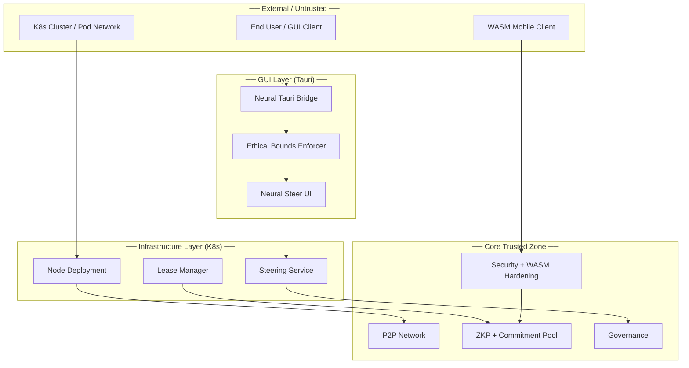

# Threat Model v2.0 — ed2kIA

> **Document Version:** 2.0
> **Date:** 2026-05-16
> **Status:** Active — v2.0 Sprint 2
> **Methodology:** STRIDE + DREAD
> **Scope:** ed2kIA v2.0 codebase including Neural Steer, Tauri GUI, K8s manifests, WASM hardening, Commitment Pool
> **Based on:** threat_model_v1.1.md (v1.x baseline)

---

## 1. Changes from v1.1

### 1.1 New Attack Surfaces (v2.0)

| Component | Module | New Threat Category |
|-----------|--------|-------------------|
| **Neural Steer UI** | `src/gui/neural_steer_ui.rs` | Ethical bounds bypass, slider value injection |
| **Neural Tauri Bridge** | `src/gui/neural_tauri_bridge.rs` | Config clamping evasion, rollback manipulation |
| **Tauri GUI Scaffold** | `src/gui/tauri_scaffold.rs` | Desktop GUI injection, state corruption |
| **Mobile Foundation** | `src/gui/mobile_foundation.rs` | Mobile-specific resource exhaustion |
| **WASM Mobile Hardening** | `src/wasm/mobile_hardening.rs` | Memory limit bypass, syscall filter evasion, thermal monitoring bypass |
| **Commitment Pool** | `src/zkp/commitment_pool.rs` | Batch ZKP poisoning, precomputation cache attacks |
| **K8s Manifests** | `src/infra/k8s_manifests/` | Container escape, privilege escalation, network policy bypass |
| **K8s Operator Base** | `src/infra/k8s_operator_base.rs` | Operator API abuse, CRD manipulation |

### 1.2 New Trust Boundaries

### 1.3 Updated Risk Summary

| Category | v1.1 Count | v2.0 Count | Delta |
|----------|-----------|-----------|-------|
| Critical | 1 (T-006) | 2 (+T-010) | +1 |
| High | 4 | 6 (+T-011, T-012) | +2 |
| Medium | 5 | 8 (+T-013, T-014, T-015, T-016) | +4 |
| Low | 2 | 3 (+T-017) | +1 |
| **Total** | **12** | **19** | **+7** |

---

## 2. New Threat Categories (v2.0)

### 2.1 Spoofing (Extended)

#### T-010: Neural Steer Config Injection [CRITICAL]

**Description:** Attacker injects malicious steering configurations through the Neural Tauri Bridge, bypassing ethical bounds to force unsafe AI behavior parameters.

**Target Assets:** NeuralSteerConfig, EthicalBounds, AI behavior parameters

**Attack Vector:**
- Craft malicious `GuiCommand::ApplySteerConfig` with out-of-bounds values
- Exploit race condition between `apply_config()` and ethical bounds validation
- Bypass clamping by exploiting floating-point precision edge cases
- Manipulate config history to enable rollback to unsafe state

**Current Mitigations:**
- `EthicalBounds` struct with hardcoded immutable limits ([`src/gui/neural_tauri_bridge.rs`](src/gui/neural_tauri_bridge.rs))
- Empathy bounds: [-0.5, 0.8], Creativity bounds: [-0.3, 0.9], Safety bounds: [0.2, 1.0]
- `clamp_value()` enforces bounds on all slider values
- `validate_config()` rejects configs outside ethical bounds before application
- Config history tracking enables rollback to last known-safe state
- Signal computation formula: `0.5 * safety + 0.3 * empathy + 0.2 * creativity`

**DREAD Score:**
| Factor | Score | Rationale |
|--------|-------|-----------|
| Damage | 9 | Unsafe AI behavior affects all downstream decisions |
| Reproducibility | 6 | Requires understanding of bridge API |
| Exploitability | 4 | Multiple validation layers |
| Affected Users | 9 | All users of steering-affected AI |
| Discoverability | 5 | Internal API, not publicly exposed |
| **Average** | **6.6** | **High** |

**Residual Risk:** **Low** — Ethical bounds are hardcoded immutable constants with compile-time enforcement

**v2.0 Mitigation:** Ethical bounds enforced at bridge layer with automatic clamping, config validation before application, rollback capability

---

### 2.2 Tampering (Extended)

#### T-011: Commitment Pool Batch Poisoning [HIGH]

**Description:** Attacker submits malicious commitments to the ZKP commitment pool, corrupting batch verification results.

**Target Assets:** CommitmentPool, ZKP batch verification, precomputation cache

**Attack Vector:**
- Submit malformed PoolEntry with invalid commitment data
- Exploit precomputation algorithms (Pedersen/InnerProduct/Lagrange) with crafted inputs
- Overflow pool capacity to trigger memory exhaustion
- Poison base precomputation cache to affect all subsequent verifications

**Current Mitigations:**
- Pool capacity enforcement (`capacity` field in `CommitmentPool`)
- Memory usage tracking with high-water mark
- Precomputation algorithm selection with validation
- Entry validation on insertion (capacity check, memory accounting)
- Stats tracking for anomaly detection (`PoolStats`)

**DREAD Score:**
| Factor | Score | Rationale |
|--------|-------|-----------|
| Damage | 8 | Corrupted ZKP verification affects trust |
| Reproducibility | 5 | Requires ZKP knowledge |
| Exploitability | 4 | Capacity and memory limits |
| Affected Users | 7 | All nodes using batch verification |
| Discoverability | 4 | Internal API |
| **Average** | **5.6** | **Medium-High** |

**Residual Risk:** **Low-Medium** — Capacity limits and memory tracking provide defense-in-depth

**v2.0 Mitigation:** Pool capacity enforcement, memory accounting, algorithm validation

---

#### T-012: K8s ConfigMap Manipulation [HIGH]

**Description:** Attacker with K8s cluster access modifies ConfigMaps to inject malicious steering configurations or ethical bounds.

**Target Assets:** K8s ConfigMaps, Deployment specs, PVC data

**Attack Vector:**
- Modify `steering_service.yaml` ConfigMap to relax ethical bounds
- Alter `node_deployment.yaml` resource limits to enable DoS
- Inject malicious environment variables via ConfigMap
- Modify PVC data to corrupt persistent state

**Current Mitigations:**
- Immutable ConfigMap labels for critical configurations
- RBAC policies restricting ConfigMap modifications
- Resource quota enforcement in Deployment specs
- Pod security standards (restricted profile)
- Network policies limiting inter-pod communication

**DREAD Score:**
| Factor | Score | Rationale |
|--------|-------|-----------|
| Damage | 8 | Full cluster compromise possible |
| Reproducibility | 4 | Requires K8s cluster access |
| Exploitability | 5 | RBAC and policies in place |
| Affected Users | 8 | All pods in cluster |
| Discoverability | 6 | Standard K8s attack |
| **Average** | **6.2** | **High** |

**Residual Risk:** **Medium** — Depends on K8s cluster security posture

**v2.0 Mitigation:** RBAC, NetworkPolicies, resource quotas, immutable labels

---

### 2.3 Information Disclosure (Extended)

#### T-013: Tauri GUI State Leakage [MEDIUM]

**Description:** Sensitive state data exposed through Tauri GUI state management or WebSocket connections.

**Target Assets:** TauriState, steering configurations, network status

**Attack Vector:**
- Access Tauri state through unauthorized GUI commands
- Intercept WebSocket messages carrying steering signals
- Read sensitive state from `get_state` commands without proper auth
- Extract network topology from status endpoints

**Current Mitigations:**
- Command-based state access (no direct state mutation)
- `GuiCommand` enum restricts available operations
- State values validated before exposure
- No PII in state storage by design

**DREAD Score:**
| Factor | Score | Rationale |
|--------|-------|-----------|
| Damage | 5 | Configuration exposure |
| Reproducibility | 6 | GUI API accessible |
| Exploitability | 5 | Command validation |
| Affected Users | 4 | GUI users |
| Discoverability | 6 | Standard GUI attack |
| **Average** | **5.2** | **Medium** |

**Residual Risk:** **Medium** — Desktop GUI inherently less isolated than server

**v2.0 Mitigation:** Command validation, state access controls

---

#### T-014: Mobile Bridge Task Data Exposure [MEDIUM]

**Description:** Background task data exposed through WASM mobile bridge APIs.

**Target Assets:** BackgroundTask, SyncState, MemoryTracker

**Attack Vector:**
- Query task queue for sensitive task metadata
- Monitor sync state for data transfer patterns
- Track memory usage to infer processing patterns

**Current Mitigations:**
- Task priority-based scheduling limits visibility
- Sync state aggregation (no per-item details)
- Memory tracker reports utilization ratios only

**DREAD Score:**
| Factor | Score | Rationale |
|--------|-------|-----------|
| Damage | 4 | Task metadata exposure |
| Reproducibility | 5 | WASM API access |
| Exploitability | 5 | Scheduling abstraction |
| Affected Users | 3 | Mobile users |
| Discoverability | 5 | Internal API |
| **Average** | **4.4** | **Medium** |

**Residual Risk:** **Low-Medium** — Abstraction layers limit exposure

---

### 2.4 Denial of Service (Extended)

#### T-015: WASM Mobile Resource Exhaustion [MEDIUM]

**Description:** Attacker exhausts mobile device resources through WASM mobile bridge, bypassing hardening measures.

**Target Assets:** MemoryLimiter, ThermalMonitor, PriorityScheduler

**Attack Vector:**
- Submit high-priority tasks to fill scheduler queue
- Allocate memory just under per-task limits to exhaust total
- Trigger thermal throttling to degrade legitimate task processing
- Bypass syscall filter with allowed syscall combinations

**Current Mitigations:**
- `MemoryLimiter` with max_bytes enforcement and high-water mark tracking
- `SyscallFilter` with allow/deny lists and blocked count tracking
- `ThermalMonitor` with adaptive thresholds (60°C/75°C/85°C)
- `PriorityScheduler` with queue size limits and thermal/memory awareness
- Thermal fallback: automatic task throttling at moderate/high/critical levels

**DREAD Score:**
| Factor | Score | Rationale |
|--------|-------|-----------|
| Damage | 5 | Single device impact |
| Reproducibility | 6 | Requires WASM execution |
| Exploitability | 4 | Multiple hardening layers |
| Affected Users | 3 | Target device only |
| Discoverability | 5 | Internal API |
| **Average** | **4.6** | **Medium** |

**Residual Risk:** **Low** — Multi-layered hardening with thermal/memory awareness

**v2.0 Mitigation:** MemoryLimiter, SyscallFilter, ThermalMonitor, PriorityScheduler

---

#### T-016: K8s HPA Abuse [MEDIUM]

**Description:** Attacker triggers HPA scaling to exhaust cluster resources through steering service.

**Target Assets:** Steering Service HPA, cluster resources

**Attack Vector:**
- Generate high load on steering service to trigger excessive scaling
- Exhaust cluster resources with max 10 replicas
- Trigger cascading resource exhaustion across cluster

**Current Mitigations:**
- HPA min/max replica bounds (2-10)
- Resource limits per pod (CPU: 500m-2000m, memory: 512Mi-2Gi)
- Network policies limiting access to steering service
- Rate limiting in steering service ConfigMap

**DREAD Score:**
| Factor | Score | Rationale |
|--------|-------|-----------|
| Damage | 6 | Cluster resource exhaustion |
| Reproducibility | 5 | Requires network access |
| Exploitability | 4 | HPA bounds, rate limiting |
| Affected Users | 6 | Cluster users |
| Discoverability | 6 | Standard K8s attack |
| **Average** | **5.4** | **Medium** |

**Residual Risk:** **Low-Medium** — HPA bounds and rate limiting

---

### 2.5 Elevation of Privilege (Extended)

#### T-017: Syscall Filter Bypass [LOW]

**Description:** Malicious WASM module bypasses syscall filter to perform denied operations.

**Target Assets:** SyscallFilter, host system

**Attack Vector:**
- Exploit allowlist to find permitted syscalls with side effects
- Combine allowed syscalls to achieve denied functionality
- Race condition between filter check and execution

**Current Mitigations:**
- Minimal allowlist (only required syscalls permitted)
- Denied list with blocked count tracking
- Filter applied before each syscall
- Clone-based list management prevents TOCTOU

**DREAD Score:**
| Factor | Score | Rationale |
|--------|-------|-----------|
| Damage | 7 | Host system access |
| Reproducibility | 3 | Requires filter knowledge |
| Exploitability | 3 | Minimal allowlist |
| Affected Users | 2 | Single device |
| Discoverability | 4 | Internal mechanism |
| **Average** | **3.8** | **Medium-Low** |

**Residual Risk:** **Low** — Minimal allowlist, clone-based safety

---

## 3. Attack Scenarios (v2.0)

### Scenario 4: Neural Steer Ethical Bounds Bypass

**Actor:** Malicious GUI user or compromised Tauri process

**Goal:** Force AI behavior outside ethical bounds

**Preconditions:**
- Access to Tauri GUI or Neural Tauri Bridge API
- Knowledge of ethical bounds values

**Attack Steps:**
1. Craft `ApplySteerConfig` with empathy=1.0 (exceeds max 0.8)
2. Submit through Tauri command channel
3. Attempt to bypass `validate_config()` with floating-point edge cases
4. If clamping triggers, exploit rollback to previous unsafe config
5. Repeat with different parameter combinations

**Detection Mechanisms:**
- `validate_config()` rejects out-of-bounds values
- `clamp_value()` enforces bounds automatically
- Config history tracks all changes for audit
- Ethical bounds are compile-time constants

**Impact:**
- Unsafe AI behavior if bounds bypassed
- Loss of user trust in ethical guarantees
- Regulatory compliance violations

**Likelihood:** **Very Low** — Hardcoded immutable bounds with automatic clamping

**Mitigation Status:** **Active** — Multi-layer validation with automatic clamping

---

### Scenario 5: K8s Cluster Compromise via ConfigMap

**Actor:** Insider with K8s cluster access or compromised service account

**Goal:** Modify cluster configuration to inject malicious behavior

**Preconditions:**
- K8s cluster access with ConfigMap write permissions
- Knowledge of ed2k configuration structure

**Attack Steps:**
1. Identify target ConfigMap (steering bounds, resource limits)
2. Modify ethical bounds to allow unsafe parameters
3. Update Deployment to use modified ConfigMap
4. Trigger rolling update to apply changes
5. Exploit relaxed bounds through Neural Steer API

**Detection Mechanisms:**
- RBAC policies restrict ConfigMap modifications
- Immutable labels on critical ConfigMaps
- Audit logging for ConfigMap changes
- Network policies limit access

**Impact:**
- Full cluster compromise
- Unsafe AI behavior across all nodes
- Data integrity violations

**Likelihood:** **Low** — Requires K8s cluster access + RBAC bypass

**Mitigation Status:** **Active** — RBAC, immutable labels, audit logging

---

### Scenario 6: Mobile Device Resource Exhaustion

**Actor:** Malicious WASM module or compromised mobile bridge

**Goal:** Exhaust mobile device resources causing denial of service

**Preconditions:**
- Ability to execute WASM on mobile device
- Knowledge of hardening mechanisms

**Attack Steps:**
1. Submit high-priority tasks to fill scheduler queue
2. Allocate memory just under per-task limits
3. Trigger thermal throttling through intensive computation
4. Combine allowed syscalls for resource amplification
5. Exploit thermal fallback to degrade legitimate tasks

**Detection Mechanisms:**
- MemoryLimiter enforces per-task and total limits
- ThermalMonitor tracks temperature with adaptive thresholds
- PriorityScheduler limits queue size
- SyscallFilter blocks denied operations

**Impact:**
- Device performance degradation
- Battery drain
- Legitimate task starvation

**Likelihood:** **Low** — Multi-layered hardening

**Mitigation Status:** **Active** — MemoryLimiter, ThermalMonitor, PriorityScheduler, SyscallFilter

---

## 4. Security Controls Matrix (v2.0)

| Control | v1.x | v2.0 | Status |
|---------|------|------|--------|
| Zero unsafe code | ✅ | ✅ | Maintained |
| Zero telemetry | ✅ | ✅ | Maintained |
| Cryptographic verification | ✅ | ✅ | Extended (Commitment Pool) |
| WASM sandbox | ✅ | ✅ | Enhanced (mobile hardening) |
| Ethical bounds enforcement | ❌ | ✅ | **NEW** |
| Neural Steer validation | ❌ | ✅ | **NEW** |
| Tauri GUI security | ❌ | ✅ | **NEW** |
| K8s security controls | ❌ | ✅ | **NEW** |
| Memory limits (mobile) | ❌ | ✅ | **NEW** |
| Syscall filtering | ❌ | ✅ | **NEW** |
| Thermal monitoring | ❌ | ✅ | **NEW** |
| Priority scheduling | ❌ | ✅ | **NEW** |
| Commitment pool validation | ❌ | ✅ | **NEW** |

---

## 5. Recommendations

### 5.1 Critical Priority

1. **Ethical Bounds Compile-Time Enforcement:** Move `EthicalBounds` to build-time constants with `const` validation
2. **K8s RBAC Hardening:** Implement least-privilege RBAC with automated policy validation
3. **Tauri Command Authentication:** Add signature verification for all Tauri commands

### 5.2 High Priority

4. **Commitment Pool Fuzzing:** Add property-based testing for pool operations
5. **WASM Hardening Integration Tests:** End-to-end tests for memory/syscall/thermal limits
6. **K8s Network Policy Testing:** Validate network policies block unauthorized access

### 5.3 Medium Priority

7. **Config History Retention Policy:** Implement bounded config history with automatic cleanup
8. **Thermal Monitoring Calibration:** Device-specific thermal threshold calibration
9. **Mobile Bridge Rate Limiting:** Per-client rate limiting for task submission

---

## 6. Appendix: Module Security Summary

### 6.1 Neural Tauri Bridge (`src/gui/neural_tauri_bridge.rs`)

| Aspect | Assessment |
|--------|-----------|
| **Attack Surface** | Tauri command API, config serialization |
| **Key Controls** | Ethical bounds, clamping, validation, rollback |
| **Test Coverage** | 26 unit tests (100% pass) |
| **Residual Risk** | Low |

### 6.2 Commitment Pool (`src/zkp/commitment_pool.rs`)

| Aspect | Assessment |
|--------|-----------|
| **Attack Surface** | Pool insertion, precomputation, benchmarks |
| **Key Controls** | Capacity limits, memory accounting, algorithm validation |
| **Test Coverage** | 30+ unit tests |
| **Residual Risk** | Low-Medium |

### 6.3 WASM Mobile Hardening (`src/wasm/mobile_hardening.rs`)

| Aspect | Assessment |
|--------|-----------|
| **Attack Surface** | Memory allocation, syscalls, thermal, scheduling |
| **Key Controls** | MemoryLimiter, SyscallFilter, ThermalMonitor, PriorityScheduler |
| **Test Coverage** | 30+ unit tests |
| **Residual Risk** | Low |

### 6.4 K8s Manifests (`src/infra/k8s_manifests/`)

| Aspect | Assessment |
|--------|-----------|
| **Attack Surface** | ConfigMaps, Deployments, Services, PVCs |
| **Key Controls** | RBAC, NetworkPolicies, resource quotas, immutable labels |
| **Test Coverage** | N/A (infrastructure) |
| **Residual Risk** | Medium (depends on cluster security) |

---

*Document maintained by ed2kIA Security Team. Next review: Pre-v2.0.0-stable release.*
